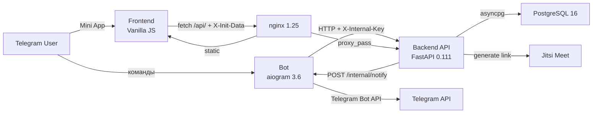
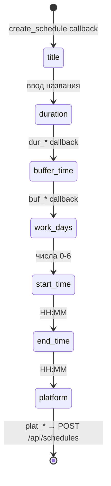
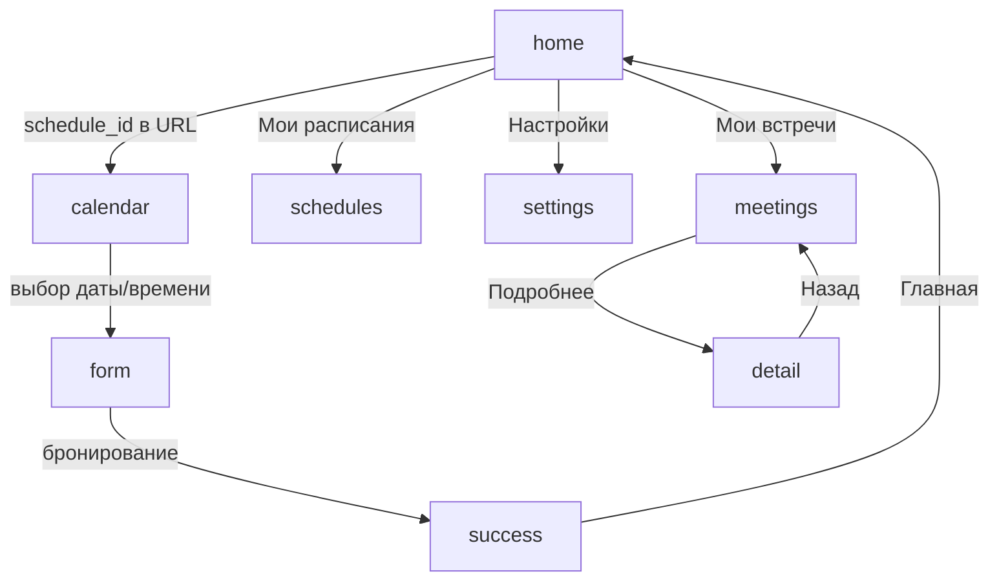
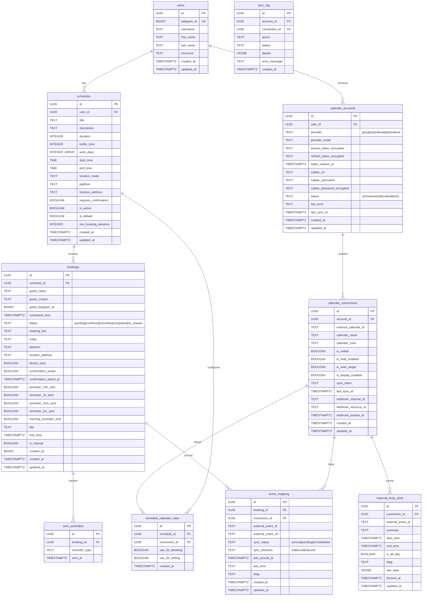
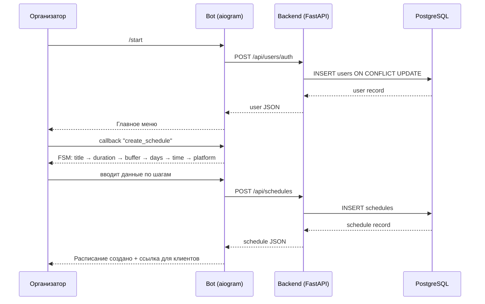
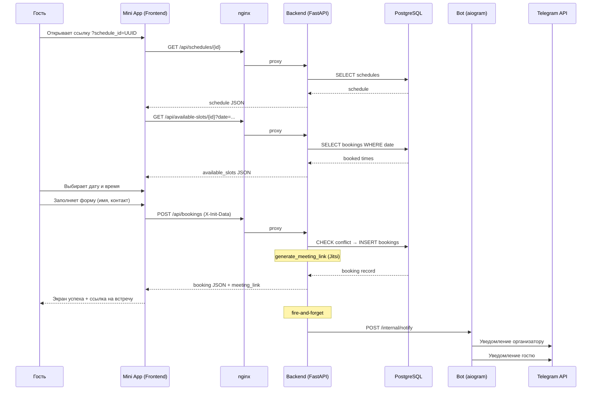
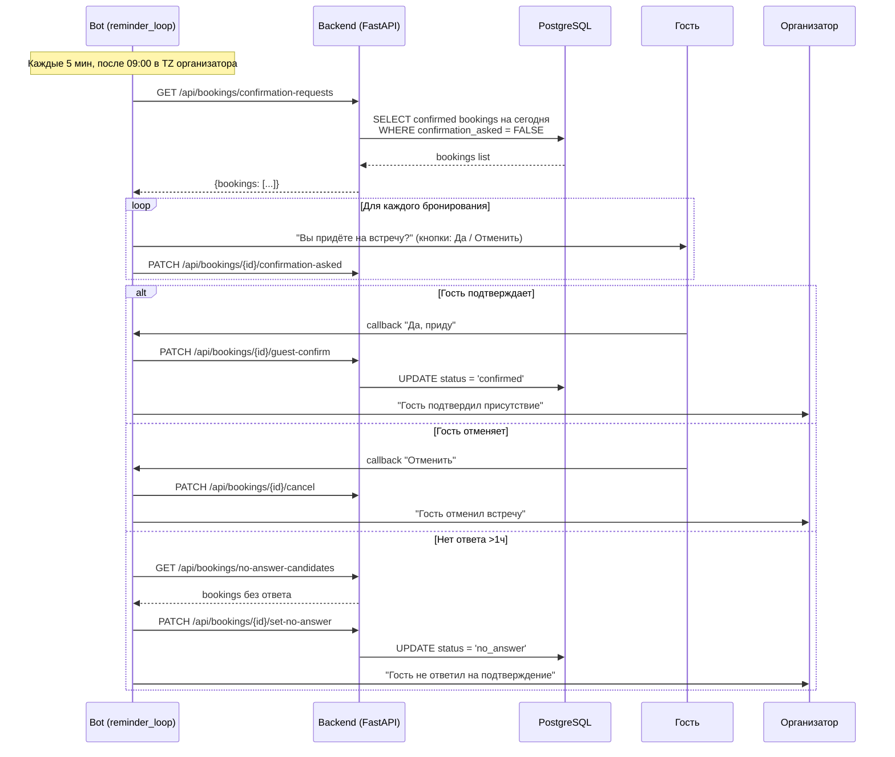
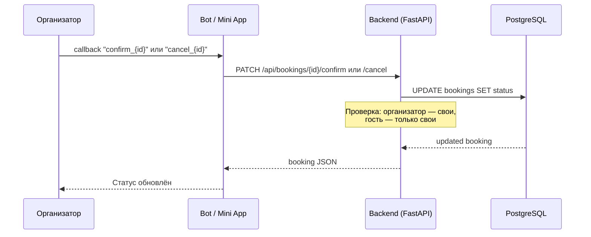

# Архитектура системы «До встречи»

> Последнее обновление: 15.04.2026

## Обзор

«До встречи» — Telegram Mini App для бронирования встреч, аналог Calendly.
Система обслуживает два типа пользователей: **организатор** создаёт расписания
через Telegram-бота и делится ссылкой, **гость** открывает Mini App, выбирает
свободный слот и бронирует встречу. Оба получают ссылку на видеозвонок (Jitsi Meet).

Архитектура — классический монолит из четырёх Docker-контейнеров: бот (aiogram),
API-сервер (FastAPI), фронтенд (Vanilla JS, раздаётся nginx), база данных (PostgreSQL).
Все сервисы развёрнуты на российском VPS (Timeweb) для соответствия 152-ФЗ.

## Высокоуровневая схема

## Компоненты

### Bot (`bot/`)

**Назначение:** Telegram-интерфейс для организатора — создание расписаний, управление
бронированиями, просмотр статистики. Единая точка входа для пользователей.

**Технологии:** aiogram 3.6.0, aiohttp 3.9.5, Python 3.12

**Модули:** `bot.py` (инициализация), `handlers/` (команды, callbacks, FSM, `inline.py` — inline query handler для шаринга расписаний),
`services/` (notifications.py — aiohttp сервер :8080, reminders.py — фоновые напоминания),
`keyboards.py`, `formatters.py`, `states.py`, `api.py`, `config.py`

**Команды бота:**

| Команда | Описание |
|---------|----------|
| `/start` | Регистрация пользователя + главное меню |
| `/help` | Справка по использованию |

**FSM: создание расписания (CreateSchedule)**

**Menu Button:** кнопка «Открыть» в чате — открывает Mini App через `MenuButtonWebApp`.
Устанавливается глобально при старте бота и per-user при `/start`.

**Уведомления:** бот принимает push-уведомления о новых бронированиях через внутренний
HTTP-сервер (aiohttp на порту 8080, endpoint `/internal/notify`). Backend отправляет
fire-and-forget POST при создании бронирования. Бот уведомляет и организатора, и гостя.

**FSM Storage:** Redis (`RedisStorage` из aiogram) с graceful fallback на `MemoryStorage` если Redis недоступен. FSM-состояния сохраняются при перезапуске бота.

**Напоминания:** фоновый цикл `reminder_loop()` каждые 5 минут проверяет
`GET /api/bookings/pending-reminders` и рассылает напоминания за 24ч и 1ч до встречи.
Каждые 15 мин вызывает `POST /api/bookings/complete-past` — переводит подтверждённые встречи в статус `completed` через 30 мин после окончания.

**ReplyKeyboard:** при `/start` бот устанавливает постоянную нижнюю панель (4 кнопки:
Создать расписание, Мои расписания, Мои встречи, Помощь).

### Backend API (`backend/`)

**Назначение:** REST API — единственный компонент с доступом к БД. Обрабатывает
CRUD расписаний и бронирований, рассчитывает свободные слоты, генерирует ссылки на встречи.

**Технологии:** FastAPI 0.111.0, asyncpg 0.29.0, pydantic 2.7.1, Python 3.12

**Модули:** `main.py` (app, lifespan, middleware), `routers/` (users, schedules, bookings,
meetings, stats, admin, `calendar.py` — 12 эндпоинтов календарной интеграции: OAuth, accounts, connections, sync, webhooks, CalDAV),
`auth.py` (initData HMAC + admin sessions), `database.py` (pool),
`schemas.py` (Pydantic-модели), `utils.py` (row_to_dict, generate_meeting_link, _notify_bot), `config.py`

**Все эндпоинты:**

| Метод | Путь | Auth | Описание | Параметры |
|-------|------|------|----------|-----------|
| GET | `/` | — | Healthcheck | — |
| GET | `/health` | — | Проверка подключения к БД | — |
| POST | `/api/users/auth` | initData | Upsert пользователя | body: `UserAuth` |
| PATCH | `/api/users/notification-settings` | initData | Обновить настройки напоминаний | body: `{settings}` |
| GET | `/api/users/{telegram_id}/avatar` | — | Проксирование аватарки из Telegram | path: telegram_id |
| GET | `/api/users/{telegram_id}` | — | Получить пользователя | path: telegram_id |
| POST | `/api/schedules` | initData | Создать расписание | body: `ScheduleCreate` |
| GET | `/api/schedules` | initData | Список расписаний пользователя | — |
| GET | `/api/schedules/{schedule_id}` | — | Детали расписания (публичный) | path: schedule_id (UUID) |
| PATCH | `/api/schedules/{schedule_id}` | initData | Обновить расписание | path: schedule_id, body: `ScheduleUpdate` |
| DELETE | `/api/schedules/{schedule_id}` | initData | Мягкое удаление (is_active=FALSE) | path: schedule_id |
| GET | `/api/available-slots/{schedule_id}` | — | Свободные слоты на дату | query: date, viewer_tz |
| POST | `/api/bookings` | optional | Создать бронирование + push | body: `BookingCreate` |
| GET | `/api/bookings` | initData | Список бронирований | query: role (organizer/guest/all) |
| GET | `/api/bookings/{booking_id}` | optional | Детали бронирования + my_role | path: booking_id |
| POST | `/api/meetings/quick` | initData | Создать встречу вручную (личная или в расписание) | body: `QuickMeetingCreate` |
| PATCH | `/api/bookings/{booking_id}/confirm` | initData | Подтвердить (организатор) | path: booking_id |
| PATCH | `/api/bookings/{booking_id}/guest-confirm` | initData | Гость подтверждает присутствие | path: booking_id |
| PATCH | `/api/bookings/{booking_id}/cancel` | initData | Отменить | path: booking_id |
| GET | `/api/bookings/confirmation-requests` | — | Встречи на сегодня для утреннего подтверждения | — |
| GET | `/api/bookings/no-answer-candidates` | — | Бронирования без ответа (>1ч после запроса) | — |
| PATCH | `/api/bookings/{booking_id}/set-no-answer` | — | Перевести в статус no_answer | path: booking_id |
| PATCH | `/api/bookings/{booking_id}/confirmation-asked` | — | Отметить что запрос подтверждения отправлен | path: booking_id |
| GET | `/api/bookings/pending-reminders` | — | Бронирования для напоминаний | query: reminder_type (24h/1h/15m/5m/morning) |
| GET | `/api/bookings/pending-reminders-v2` | — | Напоминания v2 (по настройкам пользователя) | — |
| PATCH | `/api/bookings/{booking_id}/reminder-sent` | — | Пометить напоминание отправленным | query: reminder_type |
| POST | `/api/sent-reminders` | — | Записать отправленное напоминание (v2) | body: `{booking_id, reminder_type}` |
| GET | `/api/stats` | initData | Статистика пользователя | — |
| GET | `/api/calendar/google/auth-url` | initData | URL для Google OAuth | — |
| GET | `/api/calendar/google/callback` | — | OAuth callback от Google (redirect) | query: code, state |
| GET | `/api/calendar/accounts` | initData | Список подключённых календарных аккаунтов | — |
| DELETE | `/api/calendar/accounts/{account_id}` | initData | Отключить календарный аккаунт | path: account_id |
| POST | `/api/calendar/connections/{id}/toggle` | initData | Переключить read/write для календаря | path: id, body: `CalendarConnectionToggle` |
| GET | `/api/calendar/schedules/{id}/calendar-config` | initData | Привязки календарей к расписанию | path: id |
| PUT | `/api/calendar/schedules/{id}/calendar-config` | initData | Заменить привязки календарей | path: id, body: `ScheduleCalendarConfig` |
| POST | `/api/calendar/accounts/{id}/sync` | initData | Принудительная синхронизация аккаунта | path: id |
| POST | `/api/calendar/webhook/google` | — | Webhook от Google Calendar push notifications | headers: X-Goog-* |
| POST | `/api/calendar/caldav/connect` | initData | Подключить CalDAV-провайдер (Yandex/Apple) | body: `CalDAVConnectRequest` |
| GET | `/api/calendar/external-events` | initData | Внешние события для отображения | query: from_date, to_date |

**Аутентификация:** двухканальная.
- **Mini App → Backend:** заголовок `X-Init-Data` с Telegram initData. Backend валидирует HMAC-SHA256 подпись
  через `validate_init_data()` и извлекает `user.id`. Dependency: `Depends(get_current_user)`.
- **Bot → Backend:** заголовок `X-Internal-Key` с `INTERNAL_API_KEY`. `telegram_id` передаётся в query params.
- **Публичные эндпоинты:** `get_schedule`, `available_slots`, `get_user` — без auth.
- **Опциональная auth:** `create_booking` — `Depends(get_optional_user)`, гость может быть не авторизован.

**Connection pool:** asyncpg, min_size=2, max_size=10. Создаётся при старте через lifespan,
закрывается при остановке. Dependency `db()` выдаёт соединение из пула на каждый запрос.

### Support Bot (`support-bot/`)

**Назначение:** Отдельный aiogram-бот для обратной связи — пересылка сообщений пользователей
администратору и ответов обратно. Работает как relay: пользователь пишет боту, сообщение
пересылается в admin-чат, admin отвечает reply на forward — ответ уходит пользователю.

**Технологии:** aiogram 3.x, Python 3.12

**Модули:** `bot.py` (инициализация, handlers), `config.py` (BOT_TOKEN, ADMIN_CHAT_ID, ADMIN_IDS)

**Команды:** `/start` (приветствие или admin-панель), `/stats` (статистика обращений, только admin),
`/broadcast` (рассылка всем пользователям, только admin)

**Деплой:** только в beta-стеке (`docker-compose.beta.yml`, сервис `support_bot_beta`).

### Frontend Mini App (`frontend/`)

**Назначение:** SPA для гостей (бронирование) и организаторов (просмотр встреч, расписаний).
Открывается внутри Telegram как Mini App или по прямой ссылке.

**Модули:** `index.html` (разметка), `css/style.css` (все стили),
`js/` — api.js, state.js, config.js, utils.js, nav.js, bookings.js, schedules.js,
calendar.js, quickadd.js, profile.js

**Telegram WebApp SDK — используемые методы:**

| Метод | Назначение |
|-------|-----------|
| `tg.ready()` | Сигнал готовности приложения |
| `tg.expand()` | Развернуть на весь экран |
| `tg.enableClosingConfirmation()` | Предупреждение при закрытии |
| `tg.initDataUnsafe.user` | Данные пользователя Telegram |
| `tg.BackButton.show/hide/onClick` | Нативная кнопка «Назад» |
| `tg.HapticFeedback.impactOccurred` | Вибрация при действиях |
| `tg.HapticFeedback.notificationOccurred` | Вибрация success/error |
| `tg.MainButton.*` | Кнопка действия внизу экрана |
| `tg.openLink(url)` | Открыть внешнюю ссылку |

**Экраны:**

| Экран | ID | Назначение |
|-------|----|-----------|
| Главная | `screen-home` | Приветствие, статистика, меню |
| Календарь | `screen-calendar` | Выбор даты и времени для бронирования |
| Форма | `screen-form` | Ввод данных гостя (имя, контакт, заметки) |
| Успех | `screen-success` | Подтверждение бронирования, ссылка на встречу |
| Встречи | `screen-meetings` | Список встреч (предстоящие / история) |
| Детали | `screen-detail` | Детали конкретной встречи |
| Расписания | `screen-schedules` | Список расписаний организатора |
| Настройки | `screen-settings` | Профиль, уведомления |

**Навигация между экранами:**

**Взаимодействие с API:**

| Экран | Эндпоинт | Действие |
|-------|----------|----------|
| home | GET `/api/stats` | Загрузка статистики |
| home | POST `/api/users/auth` | Аутентификация |
| calendar | GET `/api/schedules/{id}` | Загрузка расписания |
| calendar | GET `/api/available-slots/{id}` | Слоты на дату (батчами по 8) |
| form | POST `/api/bookings` | Создание бронирования |
| meetings | GET `/api/bookings` | Список встреч |
| meetings | PATCH `/api/bookings/{id}/cancel` | Отмена встречи |
| schedules | GET `/api/schedules` | Список расписаний |
| schedules | DELETE `/api/schedules/{id}` | Удаление расписания |

### База данных (PostgreSQL 16)

**Индексы:** 7 B-tree индексов на FK и часто фильтруемые поля (telegram_id, schedule_id, status, scheduled_time).

**View:** `bookings_detail` — JOIN bookings + schedules + users для денормализованного чтения.

**Триггеры:** `trigger_set_updated_at()` — автообновление `updated_at` на всех таблицах.

### Инфраструктура

**Docker-compose сервисы:**

| Сервис | Образ | Порты | Volumes |
|--------|-------|-------|---------|
| postgres | postgres:16-alpine | — (internal) | postgres_data, init.sql, migrations/ |
| redis | redis:7-alpine (ECR Public) | — (internal) | redis_data |
| backend | python:3.12-slim (custom, non-root) | 8000 (internal) | — |
| bot | python:3.12-slim (custom, non-root) | 8080 (internal) | — |
| nginx | nginx:1.25-alpine (custom) | 80, 443 | nginx.conf, frontend/, admin/, certbot certs |
| certbot | certbot/certbot:latest | — (профиль ssl) | certbot_www, certbot_certs |
| support_bot_beta | python:3.12-slim (custom) | — | — (только в beta docker-compose) |

**nginx routing:**

| Путь | Upstream | Rate limit | Описание |
|------|---------|------------|----------|
| `/` | filesystem | — | Статика из `/usr/share/nginx/html` (frontend) |
| `/admin/` | filesystem | — | Админ-панель SPA, `X-Robots-Tag: noindex` |
| `/api/admin/auth/` | `http://backend:8000` | 3 req/min, burst=2 | Auth-эндпоинты с жёстким лимитом |
| `/api/admin/` | `http://backend:8000` | 5 req/s, burst=10 | Все admin API-эндпоинты |
| `/api/events` | `http://backend:8000` | 10 req/s, burst=20 | Event tracking из Mini App |
| `/api/*` | `http://backend:8000` | 10 req/s, burst=20 | Проксирование API-запросов |
| `/api/bookings` | `http://backend:8000` | 5 req/min, burst=3 | Отдельный лимит на бронирование |
| `/health` | `http://backend:8000/health` | — | Healthcheck |
| `/.well-known/acme-challenge/` | filesystem | — | Let's Encrypt challenge |

**SSL:** Let's Encrypt через certbot. HTTP (80) → редирект на HTTPS (443). TLS 1.2 + 1.3.

**Security headers:** HSTS (max-age=31536000), CSP (default-src 'self', script-src telegram.org),
X-Content-Type-Options: nosniff, Referrer-Policy: strict-origin-when-cross-origin,
Permissions-Policy (camera, microphone, geolocation disabled). `server_tokens off`.

**Переменные окружения:**

| Переменная | Сервис | Описание |
|-----------|--------|----------|
| `BOT_TOKEN` | backend, bot | Токен Telegram-бота (нужен обоим для HMAC валидации) |
| `MINI_APP_URL` | backend, bot | URL фронтенда Mini App |
| `INTERNAL_API_KEY` | backend, bot | Ключ для аутентификации бот↔backend |
| `BOT_INTERNAL_URL` | backend | URL HTTP-сервера бота (default: `http://bot:8080`) |
| `BACKEND_API_URL` | bot | URL backend (default: `http://backend:8000`) |
| `DATABASE_URL` | backend | PostgreSQL connection string |
| `SECRET_KEY` | backend | Секретный ключ |
| `POSTGRES_DB` | postgres | Имя БД (default: `dovstrechi`) |
| `POSTGRES_USER` | postgres | Пользователь (default: `dovstrechi`) |
| `POSTGRES_PASSWORD` | postgres | Пароль PostgreSQL |
| `ADMIN_TELEGRAM_ID` | backend | Telegram ID администратора (единственный допустимый) |
| `ADMIN_SESSION_TTL_HOURS` | backend | Время жизни admin-сессии (default: 2) |
| `ADMIN_IP_ALLOWLIST` | backend | Белый список IP (через запятую, пусто = любой) |
| `ANONYMIZE_SALT` | backend | Соль для SHA256-анонимизации telegram_id |

## Admin API

Внутренняя админ-панель. Все `/api/admin/*` эндпоинты (кроме login) защищены cookie-based сессией через `Depends(get_admin_user)`. Доступ только для `ADMIN_TELEGRAM_ID`.

### Аутентификация

| Метод | Путь | Auth | Описание |
|-------|------|------|----------|
| POST | `/api/admin/auth/login` | Telegram Login Widget | Вход: HMAC-SHA256 верификация → cookie `admin_session` |
| POST | `/api/admin/auth/logout` | cookie | Деактивация сессии, удаление cookie |
| GET | `/api/admin/auth/me` | cookie | Данные текущей сессии |

### Dashboard

| Метод | Путь | Описание |
|-------|------|----------|
| GET | `/api/admin/dashboard/summary` | 6 метрик: users, active_7d, bookings, today, errors_24h, pending |
| GET | `/api/admin/dashboard/bookings-trend?days=30` | Бронирования по дням за N дней |
| GET | `/api/admin/dashboard/platforms` | Распределение расписаний по платформам |

### Logs (app_events)

| Метод | Путь | Описание |
|-------|------|----------|
| GET | `/api/admin/logs` | Пагинированный список событий с фильтрами (event_type, severity, date, search) |
| GET | `/api/admin/logs/stats` | Агрегация за 24ч: by_severity, by_type, unique_users |

### Tasks (Kanban)

| Метод | Путь | Описание |
|-------|------|----------|
| GET | `/api/admin/tasks` | Все задачи, сгруппированные по статусу (backlog/in_progress/done) |
| POST | `/api/admin/tasks` | Создать задачу |
| PATCH | `/api/admin/tasks/reorder` | Перестановка задач в колонке |
| PATCH | `/api/admin/tasks/{id}` | Обновить задачу (при смене status — пересчёт priority) |
| DELETE | `/api/admin/tasks/{id}` | Физическое удаление задачи |

### Audit Log

| Метод | Путь | Описание |
|-------|------|----------|
| GET | `/api/admin/audit-log` | Пагинированный лог действий администратора |

### System & Maintenance

| Метод | Путь | Описание |
|-------|------|----------|
| GET | `/api/admin/system/info` | Версия, uptime, pool stats, счётчики, окружение (без секретов) |
| POST | `/api/admin/sessions/invalidate-all` | Деактивировать все сессии кроме текущей |
| POST | `/api/admin/maintenance/cleanup-events` | Удалить info/warn события старше N дней (error/critical защищены) |

### Event Tracking (публичный)

| Метод | Путь | Auth | Описание |
|-------|------|------|----------|
| POST | `/api/events` | optional initData | Трекинг событий из Mini App (анонимизированный) |

### Admin Panel (Frontend)

**Расположение:** `admin/` — SPA, раздаётся nginx с `/admin/`. Модули: `index.html` (разметка),
`css/admin.css` (стили), `js/` — config.js, auth.js, dashboard.js, logs.js, tasks.js, settings.js.

**Auth flow:**
1. Пользователь открывает `/admin/` → JS проверяет `GET /api/admin/auth/me`
2. Если 401 → экран логина с Telegram Login Widget
3. Нажатие "Log in with Telegram" → Telegram OAuth → `onTelegramAuth(user)`
4. JS отправляет `POST /api/admin/auth/login` с данными от Telegram
5. Backend верифицирует HMAC, проверяет `telegram_id == ADMIN_TELEGRAM_ID`, создаёт сессию
6. Cookie `admin_session` устанавливается (HttpOnly, Secure, SameSite=Strict, path=/api/admin)
7. JS переключает на экран дашборда

**SPA-навигация:** hash-роутинг (#dashboard, #logs, #tasks, #settings).

**Rate limiting:** auth — 3 req/min (nginx) + 3 attempts/5min (backend in-memory), прочие admin — 5 req/s.

## Основные потоки данных

### Создание расписания (организатор)

### Бронирование встречи (гость)

> **Примечание:** BOT2/TG2 в диаграмме — это бот-сервис и Telegram API,
> показаны отдельно для наглядности потока уведомлений.

### Утреннее подтверждение (Morning Confirmation Flow)

### Подтверждение / отмена встречи

### Уведомления

**Push-уведомления о новых бронированиях:**
1. Гость создаёт бронирование → backend POST `/api/bookings`
2. Backend отправляет fire-and-forget `POST http://bot:8080/internal/notify` с данными бронирования
3. Бот (`handle_new_booking`) отправляет сообщение организатору (с кнопками ✅/❌) и гостю

**Напоминания о предстоящих встречах:**
1. Фоновый цикл `reminder_loop()` в боте — каждые 5 минут
2. Запрашивает `GET /api/bookings/pending-reminders?reminder_type=24h|1h`
3. Backend возвращает confirmed бронирования с `reminder_*_sent = FALSE` в нужном временном окне
4. Бот отправляет напоминание организатору и гостю
5. Помечает отправленным: `PATCH /api/bookings/{id}/reminder-sent?reminder_type=24h|1h`

**Таймзоны:** все даты/времена в уведомлениях форматируются в таймзоне организатора
(`users.timezone`, default 'UTC') через `format_dt(dt_str, tz=...)`.
