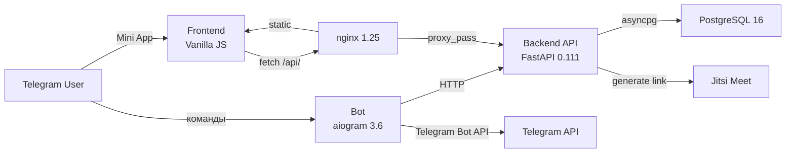
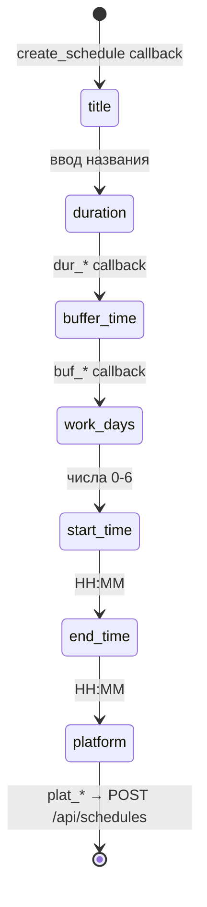
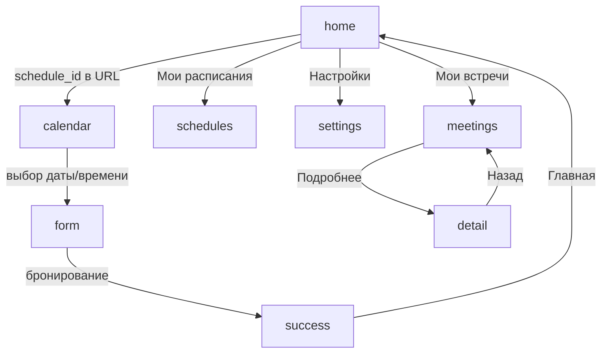
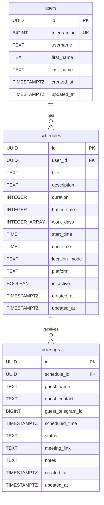
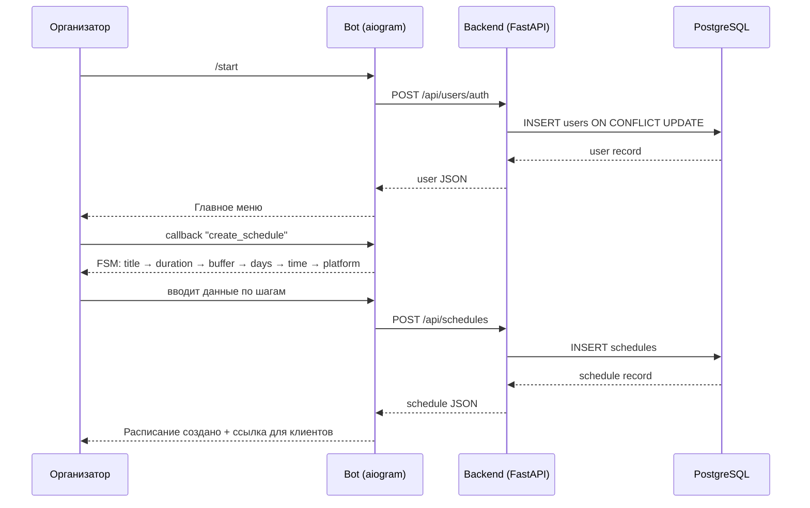
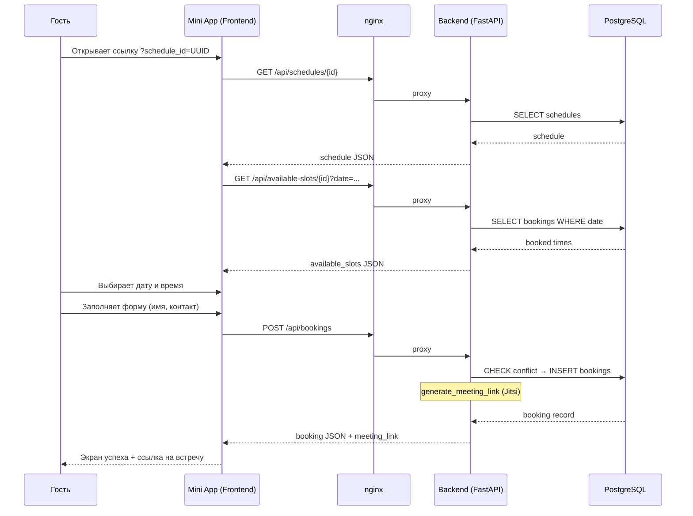
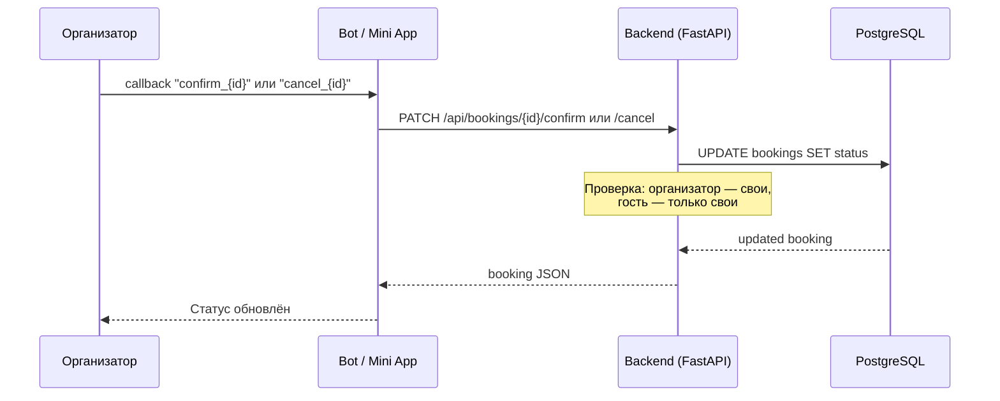

# Архитектура системы «До встречи»

## Обзор

«До встречи» — Telegram Mini App для бронирования встреч, аналог Calendly.
Система обслуживает два типа пользователей: **организатор** создаёт расписания
через Telegram-бота и делится ссылкой, **гость** открывает Mini App, выбирает
свободный слот и бронирует встречу. Оба получают ссылку на видеозвонок (Jitsi Meet).

Архитектура — классический монолит из четырёх Docker-контейнеров: бот (aiogram),
API-сервер (FastAPI), фронтенд (Vanilla JS, раздаётся nginx), база данных (PostgreSQL).
Все сервисы развёрнуты на российском VPS (Timeweb) для соответствия 152-ФЗ.

## Высокоуровневая схема

## Компоненты

### Bot (`bot/bot.py`)

**Назначение:** Telegram-интерфейс для организатора — создание расписаний, управление
бронированиями, просмотр статистики. Единая точка входа для пользователей.

**Технологии:** aiogram 3.6.0, aiohttp 3.9.5, Python 3.12

**Команды бота:**

| Команда | Описание |
|---------|----------|
| `/start` | Регистрация пользователя + главное меню |
| `/help` | Справка по использованию |

**FSM: создание расписания (CreateSchedule)**

**Menu Button:** кнопка «Открыть» в чате — открывает Mini App через `MenuButtonWebApp`.

**Уведомления:** бот пока не отправляет push-уведомлений при бронировании.
Организатор проверяет встречи вручную через меню «Мои встречи» или Mini App.

### Backend API (`backend/main.py`)

**Назначение:** REST API — единственный компонент с доступом к БД. Обрабатывает
CRUD расписаний и бронирований, рассчитывает свободные слоты, генерирует ссылки на встречи.

**Технологии:** FastAPI 0.111.0, asyncpg 0.29.0, pydantic 2.7.1, Python 3.12

**Все эндпоинты:**

| Метод | Путь | Описание | Параметры |
|-------|------|----------|-----------|
| GET | `/` | Healthcheck | — |
| GET | `/health` | Проверка подключения к БД | — |
| POST | `/api/users/auth` | Upsert пользователя | body: `UserAuth` |
| GET | `/api/users/{telegram_id}` | Получить пользователя | path: telegram_id |
| POST | `/api/schedules` | Создать расписание | body: `ScheduleCreate` |
| GET | `/api/schedules` | Список расписаний пользователя | query: telegram_id |
| GET | `/api/schedules/{schedule_id}` | Детали расписания | path: schedule_id (UUID) |
| DELETE | `/api/schedules/{schedule_id}` | Мягкое удаление (is_active=FALSE) | path: schedule_id, query: telegram_id |
| GET | `/api/available-slots/{schedule_id}` | Свободные слоты на дату | path: schedule_id, query: date (YYYY-MM-DD) |
| POST | `/api/bookings` | Создать бронирование | body: `BookingCreate` |
| GET | `/api/bookings` | Список бронирований | query: telegram_id, role (organizer/guest/all) |
| PATCH | `/api/bookings/{booking_id}/confirm` | Подтвердить | path: booking_id, query: telegram_id |
| PATCH | `/api/bookings/{booking_id}/cancel` | Отменить | path: booking_id, query: telegram_id |
| GET | `/api/stats` | Статистика пользователя | query: telegram_id |

**Аутентификация:** отсутствует. Доступ к данным контролируется по `telegram_id` в query/body.
Telegram InitData не валидируется на backend.

**Connection pool:** asyncpg, min_size=2, max_size=10. Создаётся при старте через lifespan,
закрывается при остановке. Dependency `db()` выдаёт соединение из пула на каждый запрос.

### Frontend Mini App (`frontend/index.html`)

**Назначение:** SPA для гостей (бронирование) и организаторов (просмотр встреч, расписаний).
Открывается внутри Telegram как Mini App или по прямой ссылке.

**Telegram WebApp SDK — используемые методы:**

| Метод | Назначение |
|-------|-----------|
| `tg.ready()` | Сигнал готовности приложения |
| `tg.expand()` | Развернуть на весь экран |
| `tg.enableClosingConfirmation()` | Предупреждение при закрытии |
| `tg.initDataUnsafe.user` | Данные пользователя Telegram |
| `tg.BackButton.show/hide/onClick` | Нативная кнопка «Назад» |
| `tg.HapticFeedback.impactOccurred` | Вибрация при действиях |
| `tg.HapticFeedback.notificationOccurred` | Вибрация success/error |
| `tg.MainButton.*` | Кнопка действия внизу экрана |
| `tg.openLink(url)` | Открыть внешнюю ссылку |

**Экраны:**

| Экран | ID | Назначение |
|-------|----|-----------|
| Главная | `screen-home` | Приветствие, статистика, меню |
| Календарь | `screen-calendar` | Выбор даты и времени для бронирования |
| Форма | `screen-form` | Ввод данных гостя (имя, контакт, заметки) |
| Успех | `screen-success` | Подтверждение бронирования, ссылка на встречу |
| Встречи | `screen-meetings` | Список встреч (предстоящие / история) |
| Детали | `screen-detail` | Детали конкретной встречи |
| Расписания | `screen-schedules` | Список расписаний организатора |
| Настройки | `screen-settings` | Профиль, уведомления |

**Навигация между экранами:**

**Взаимодействие с API:**

| Экран | Эндпоинт | Действие |
|-------|----------|----------|
| home | GET `/api/stats` | Загрузка статистики |
| home | POST `/api/users/auth` | Аутентификация |
| calendar | GET `/api/schedules/{id}` | Загрузка расписания |
| calendar | GET `/api/available-slots/{id}` | Слоты на дату (батчами по 8) |
| form | POST `/api/bookings` | Создание бронирования |
| meetings | GET `/api/bookings` | Список встреч |
| meetings | PATCH `/api/bookings/{id}/cancel` | Отмена встречи |
| schedules | GET `/api/schedules` | Список расписаний |
| schedules | DELETE `/api/schedules/{id}` | Удаление расписания |

### База данных (PostgreSQL 16)

**Индексы:** 7 B-tree индексов на FK и часто фильтруемые поля (telegram_id, schedule_id, status, scheduled_time).

**View:** `bookings_detail` — JOIN bookings + schedules + users для денормализованного чтения.

**Триггеры:** `trigger_set_updated_at()` — автообновление `updated_at` на всех таблицах.

### Инфраструктура

**Docker-compose сервисы:**

| Сервис | Образ | Порты | Volumes |
|--------|-------|-------|---------|
| postgres | postgres:16-alpine | — (internal) | postgres_data, init.sql |
| backend | python:3.12-slim (custom) | 8000 (internal) | — |
| bot | python:3.12-slim (custom) | — | — |
| nginx | nginx:1.25-alpine (custom) | 80, 443 | nginx.conf, frontend/, certbot certs |
| certbot | certbot/certbot:latest | — (профиль ssl) | certbot_www, certbot_certs |

**nginx routing:**

| Путь | Upstream | Описание |
|------|---------|----------|
| `/` | filesystem | Статика из `/usr/share/nginx/html` (frontend) |
| `/api/*` | `http://backend:8000` | Проксирование API-запросов |
| `/health` | `http://backend:8000/health` | Healthcheck |
| `/.well-known/acme-challenge/` | filesystem | Let's Encrypt challenge |

**SSL:** Let's Encrypt через certbot. HTTP (80) → редирект на HTTPS (443). TLS 1.2 + 1.3.

**Переменные окружения:**

| Переменная | Сервис | Описание |
|-----------|--------|----------|
| `BOT_TOKEN` | bot | Токен Telegram-бота |
| `MINI_APP_URL` | bot | URL фронтенда Mini App |
| `BACKEND_API_URL` | bot | URL backend (default: `http://backend:8000`) |
| `DATABASE_URL` | backend | PostgreSQL connection string |
| `SECRET_KEY` | backend | Секретный ключ |
| `POSTGRES_DB` | postgres | Имя БД (default: `dovstrechi`) |
| `POSTGRES_USER` | postgres | Пользователь (default: `dovstrechi`) |
| `POSTGRES_PASSWORD` | postgres | Пароль PostgreSQL |

## Основные потоки данных

### Создание расписания (организатор)

### Бронирование встречи (гость)

### Подтверждение / отмена встречи

### Уведомления

Автоматические push-уведомления **не реализованы**. Организатор узнаёт о новых
бронированиях через:
- Меню «Мои встречи» в боте (callback `my_bookings`)
- Экран «Встречи» в Mini App (GET `/api/bookings`)
- Статистику (callback `stats` / GET `/api/stats`)
