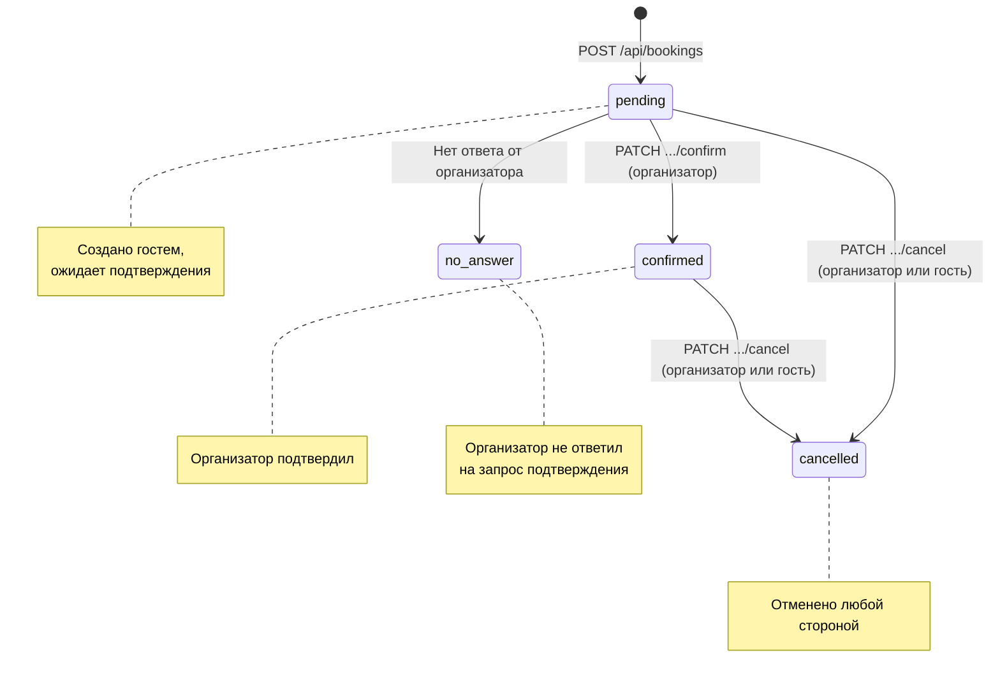

# Модели данных

> Последнее обновление: 15.04.2026

## ER-диаграмма

```mermaid
erDiagram
    users ||--o{ schedules : "создаёт"
    schedules ||--o{ bookings : "принимает"
    users ||--o{ calendar_accounts : "подключает"
    calendar_accounts ||--o{ calendar_connections : "содержит"
    calendar_connections ||--o{ schedule_calendar_rules : "правила"
    schedules ||--o{ schedule_calendar_rules : "правила"
    calendar_connections ||--o{ external_busy_slots : "занятость"
    bookings ||--o{ event_mapping : "синхронизация"
    calendar_connections ||--o{ event_mapping : "синхронизация"
    calendar_accounts ||--o{ sync_log : "логирование"
    calendar_connections ||--o{ sync_log : "логирование"
    bookings ||--o{ sent_reminders : "напоминания"

    users {
        UUID id PK "uuid_generate_v4()"
        BIGINT telegram_id UK "NOT NULL"
        TEXT username "NULL"
        TEXT first_name "NULL"
        TEXT last_name "NULL"
        TEXT timezone "NOT NULL DEFAULT UTC"
        JSONB reminder_settings "NOT NULL DEFAULT reminders+customReminders"
        TIMESTAMPTZ created_at "DEFAULT NOW()"
        TIMESTAMPTZ updated_at "DEFAULT NOW()"
    }

    schedules {
        UUID id PK "uuid_generate_v4()"
        UUID user_id FK "NOT NULL, CASCADE"
        TEXT title "NOT NULL"
        TEXT description "NULL"
        INTEGER duration "DEFAULT 60 (минуты)"
        INTEGER buffer_time "DEFAULT 0 (минуты)"
        INTEGER_ARRAY work_days "DEFAULT {0,1,2,3,4}"
        TIME start_time "DEFAULT 09:00"
        TIME end_time "DEFAULT 18:00"
        TEXT location_mode "DEFAULT fixed"
        TEXT platform "DEFAULT jitsi"
        TEXT location_address "NULL"
        BOOLEAN requires_confirmation "DEFAULT TRUE"
        BOOLEAN is_active "DEFAULT TRUE"
        TIMESTAMPTZ created_at "DEFAULT NOW()"
        TIMESTAMPTZ updated_at "DEFAULT NOW()"
    }

    bookings {
        UUID id PK "uuid_generate_v4()"
        UUID schedule_id FK "NOT NULL, CASCADE"
        TEXT guest_name "NOT NULL"
        TEXT guest_contact "NOT NULL"
        BIGINT guest_telegram_id "NULL"
        TIMESTAMPTZ scheduled_time "NOT NULL"
        TEXT status "CHECK pending confirmed cancelled completed no_answer"
        TEXT meeting_link "NULL"
        TEXT notes "NULL"
        TEXT platform "NULL (snapshot from schedule)"
        TEXT location_address "NULL (snapshot from schedule)"
        BOOLEAN blocks_slots "DEFAULT TRUE"
        BOOLEAN reminder_24h_sent "DEFAULT FALSE"
        BOOLEAN reminder_1h_sent "DEFAULT FALSE"
        BOOLEAN reminder_15m_sent "DEFAULT FALSE"
        BOOLEAN reminder_5m_sent "DEFAULT FALSE"
        BOOLEAN morning_reminder_sent "DEFAULT FALSE"
        BOOLEAN confirmation_asked "DEFAULT FALSE"
        TIMESTAMPTZ confirmation_asked_at "NULL"
        TIMESTAMPTZ created_at "DEFAULT NOW()"
        TIMESTAMPTZ updated_at "DEFAULT NOW()"
    }

    admin_sessions {
        UUID id PK "uuid_generate_v4()"
        BIGINT telegram_id "NOT NULL"
        TEXT session_token "UNIQUE NOT NULL"
        INET ip_address "NOT NULL"
        TEXT user_agent "NULL"
        TIMESTAMPTZ created_at "DEFAULT NOW()"
        TIMESTAMPTZ expires_at "NOT NULL"
        BOOLEAN is_active "DEFAULT TRUE"
    }

    admin_audit_log {
        BIGSERIAL id PK "auto"
        TEXT action "CHECK login logout etc"
        JSONB details "NULL"
        INET ip_address "NOT NULL"
        TIMESTAMPTZ created_at "DEFAULT NOW()"
    }

    app_events {
        BIGSERIAL id PK "auto"
        TEXT event_type "CHECK page_view etc"
        TEXT anonymous_id "NOT NULL (SHA256 12 chars)"
        TEXT session_id "NULL"
        JSONB metadata "NULL"
        TEXT severity "CHECK info warn error critical"
        TIMESTAMPTZ created_at "DEFAULT NOW()"
    }

    admin_tasks {
        UUID id PK "uuid_generate_v4()"
        TEXT title "NOT NULL"
        TEXT description "NULL (Markdown)"
        TEXT description_plain "NULL"
        TEXT status "CHECK backlog in_progress done"
        INTEGER priority "DEFAULT 0"
        TEXT source "CHECK manual git_commit ai_generated github_issue"
        TEXT source_ref "NULL"
        TEXT_ARRAY tags "DEFAULT {}"
        TIMESTAMPTZ created_at "DEFAULT NOW()"
        TIMESTAMPTZ updated_at "DEFAULT NOW()"
    }

    calendar_accounts {
        UUID id PK "uuid_generate_v4()"
        UUID user_id FK "NOT NULL, CASCADE"
        TEXT provider "CHECK google yandex apple outlook"
        TEXT provider_email "NULL"
        TEXT access_token_encrypted "NULL"
        TEXT refresh_token_encrypted "NULL"
        TIMESTAMPTZ token_expires_at "NULL"
        TEXT caldav_url "NULL"
        TEXT caldav_username "NULL"
        TEXT caldav_password_encrypted "NULL"
        TEXT status "CHECK active expired revoked error DEFAULT active"
        TEXT last_error "NULL"
        TIMESTAMPTZ last_sync_at "NULL"
        TIMESTAMPTZ created_at "DEFAULT NOW()"
        TIMESTAMPTZ updated_at "DEFAULT NOW()"
    }

    calendar_connections {
        UUID id PK "uuid_generate_v4()"
        UUID account_id FK "NOT NULL, CASCADE"
        TEXT external_calendar_id "NOT NULL"
        TEXT calendar_name "NOT NULL"
        TEXT calendar_color "NULL"
        BOOLEAN is_visible "DEFAULT TRUE"
        BOOLEAN is_read_enabled "DEFAULT TRUE"
        BOOLEAN is_write_target "DEFAULT FALSE"
        BOOLEAN is_display_enabled "DEFAULT FALSE"
        TEXT sync_token "NULL"
        TIMESTAMPTZ last_sync_at "NULL"
        TEXT webhook_channel_id "NULL"
        TEXT webhook_resource_id "NULL"
        TIMESTAMPTZ webhook_expires_at "NULL"
        TIMESTAMPTZ created_at "DEFAULT NOW()"
        TIMESTAMPTZ updated_at "DEFAULT NOW()"
    }

    schedule_calendar_rules {
        UUID id PK "uuid_generate_v4()"
        UUID schedule_id FK "NOT NULL, CASCADE"
        UUID connection_id FK "NOT NULL, CASCADE"
        BOOLEAN use_for_blocking "DEFAULT TRUE"
        BOOLEAN use_for_writing "DEFAULT FALSE"
        TIMESTAMPTZ created_at "DEFAULT NOW()"
    }

    external_busy_slots {
        UUID id PK "uuid_generate_v4()"
        UUID connection_id FK "NOT NULL, CASCADE"
        TEXT external_event_id "NOT NULL"
        TEXT summary "NULL"
        TIMESTAMPTZ start_time "NOT NULL"
        TIMESTAMPTZ end_time "NOT NULL"
        BOOLEAN is_all_day "DEFAULT FALSE"
        TEXT etag "NULL"
        JSONB raw_data "NULL"
        TIMESTAMPTZ fetched_at "DEFAULT NOW()"
        TIMESTAMPTZ updated_at "DEFAULT NOW()"
    }

    event_mapping {
        UUID id PK "uuid_generate_v4()"
        UUID booking_id FK "NOT NULL, CASCADE"
        UUID connection_id FK "NOT NULL, CASCADE"
        TEXT external_event_id "NOT NULL"
        TEXT external_event_url "NULL"
        TEXT sync_status "CHECK synced pending error deleted DEFAULT synced"
        TEXT sync_direction "CHECK outbound inbound DEFAULT outbound"
        TIMESTAMPTZ last_synced_at "NULL"
        TEXT last_error "NULL"
        TEXT etag "NULL"
        TIMESTAMPTZ created_at "DEFAULT NOW()"
        TIMESTAMPTZ updated_at "DEFAULT NOW()"
    }

    sync_log {
        UUID id PK "uuid_generate_v4()"
        UUID account_id FK "NULL, ON DELETE SET NULL"
        UUID connection_id FK "NULL, ON DELETE SET NULL"
        TEXT action "NOT NULL"
        TEXT status "NOT NULL"
        JSONB details "NULL"
        TEXT error_message "NULL"
        TIMESTAMPTZ created_at "DEFAULT NOW()"
    }

    sent_reminders {
        UUID id PK "uuid_generate_v4()"
        UUID booking_id FK "NOT NULL, CASCADE"
        TEXT reminder_type "NOT NULL"
        TIMESTAMPTZ sent_at "DEFAULT NOW()"
    }
```

## Таблицы базы данных

Определены в `database/init.sql`. Расширение: `uuid-ossp`.

### users

Пользователи-организаторы. Создаются при первом `/start` или открытии Mini App.

| Поле | Тип | Ограничение | Описание |
|------|-----|-------------|---------|
| id | UUID | PK, DEFAULT uuid_generate_v4() | Внутренний идентификатор |
| telegram_id | BIGINT | UNIQUE NOT NULL | Telegram user ID |
| username | TEXT | NULL | Username в Telegram (@handle) |
| first_name | TEXT | NULL | Имя из Telegram |
| last_name | TEXT | NULL | Фамилия из Telegram |
| timezone | TEXT | NOT NULL, DEFAULT 'UTC' | IANA-таймзона пользователя |
| reminder_settings | JSONB | NOT NULL, DEFAULT '{"reminders":["1440","60"],"customReminders":[]}' | Настройки напоминаний пользователя |
| created_at | TIMESTAMPTZ | NOT NULL, DEFAULT NOW() | Время регистрации |
| updated_at | TIMESTAMPTZ | NOT NULL, DEFAULT NOW() | Время последнего обновления |

**Индексы:** `idx_users_telegram_id` ON (telegram_id)

**Особенности:** при повторной авторизации (POST `/api/users/auth`) — UPSERT: обновляет username, first_name, last_name, timezone.

**Миграция:** `database/migrations/002_add_timezone.sql` — добавление колонки timezone.

### schedules

Расписания для бронирования. Организатор может создать несколько расписаний.

| Поле | Тип | Ограничение | Описание |
|------|-----|-------------|---------|
| id | UUID | PK, DEFAULT uuid_generate_v4() | Идентификатор расписания |
| user_id | UUID | FK → users(id) ON DELETE CASCADE, NOT NULL | Владелец-организатор |
| title | TEXT | NOT NULL | Название расписания |
| description | TEXT | NULL | Описание |
| duration | INTEGER | NOT NULL, DEFAULT 60 | Длительность встречи (минуты) |
| buffer_time | INTEGER | NOT NULL, DEFAULT 0 | Перерыв между встречами (минуты) |
| work_days | INTEGER[] | NOT NULL, DEFAULT '{0,1,2,3,4}' | Рабочие дни (0=Пн, 6=Вс) |
| start_time | TIME | NOT NULL, DEFAULT '09:00' | Начало рабочего дня |
| end_time | TIME | NOT NULL, DEFAULT '18:00' | Конец рабочего дня |
| location_mode | TEXT | NOT NULL, DEFAULT 'fixed' | Режим выбора платформы (fixed / user_choice) |
| platform | TEXT | NOT NULL, DEFAULT 'jitsi' | Платформа по умолчанию |
| location_address | TEXT | NULL | Адрес для офлайн-встреч |
| requires_confirmation | BOOLEAN | NOT NULL, DEFAULT TRUE | Требуется ли подтверждение организатора |
| is_active | BOOLEAN | NOT NULL, DEFAULT TRUE | Активно ли расписание |
| created_at | TIMESTAMPTZ | NOT NULL, DEFAULT NOW() | Время создания |
| updated_at | TIMESTAMPTZ | NOT NULL, DEFAULT NOW() | Время обновления |

**Индексы:**
- `idx_schedules_user_id` ON (user_id)
- `idx_schedules_is_active` ON (is_active)

**Особенности:**
- Удаление мягкое: `is_active = FALSE`. Данные остаются в БД.
- `work_days` — массив целых чисел PostgreSQL: `{0,1,2,3,4}` = Пн-Пт.
- Допустимые значения `platform`: `jitsi`, `zoom`, `other`.
- `location_mode = 'user_choice'` позволяет гостю выбрать платформу при бронировании.

### bookings

Бронирования встреч. Создаются гостями через Mini App или напрямую через API.

| Поле | Тип | Ограничение | Описание |
|------|-----|-------------|---------|
| id | UUID | PK, DEFAULT uuid_generate_v4() | Идентификатор бронирования |
| schedule_id | UUID | FK → schedules(id) ON DELETE CASCADE, NOT NULL | К какому расписанию |
| guest_name | TEXT | NOT NULL | Имя гостя |
| guest_contact | TEXT | NOT NULL | Контакт (email или @username) |
| guest_telegram_id | BIGINT | NULL | Telegram ID гостя (если есть) |
| scheduled_time | TIMESTAMPTZ | NOT NULL | Дата и время встречи |
| status | TEXT | NOT NULL, DEFAULT 'pending', CHECK (IN pending/confirmed/cancelled/completed/no_answer) | Статус бронирования |
| meeting_link | TEXT | NULL | Ссылка на видеозвонок |
| notes | TEXT | NULL | Заметки от гостя |
| platform | TEXT | NULL | Платформа (snapshot из расписания на момент бронирования) |
| location_address | TEXT | NULL | Адрес (snapshot из расписания на момент бронирования) |
| blocks_slots | BOOLEAN | NOT NULL, DEFAULT TRUE | Блокирует ли слоты в расписании |
| reminder_24h_sent | BOOLEAN | NOT NULL, DEFAULT FALSE | Отправлено ли напоминание за 24ч |
| reminder_1h_sent | BOOLEAN | NOT NULL, DEFAULT FALSE | Отправлено ли напоминание за 1ч |
| reminder_15m_sent | BOOLEAN | NOT NULL, DEFAULT FALSE | Отправлено ли напоминание за 15 мин |
| reminder_5m_sent | BOOLEAN | NOT NULL, DEFAULT FALSE | Отправлено ли напоминание за 5 мин |
| morning_reminder_sent | BOOLEAN | NOT NULL, DEFAULT FALSE | Отправлено ли утреннее напоминание |
| confirmation_asked | BOOLEAN | NOT NULL, DEFAULT FALSE | Был ли отправлен запрос подтверждения |
| confirmation_asked_at | TIMESTAMPTZ | NULL | Время отправки запроса подтверждения |
| created_at | TIMESTAMPTZ | NOT NULL, DEFAULT NOW() | Время создания |
| updated_at | TIMESTAMPTZ | NOT NULL, DEFAULT NOW() | Время обновления |

**Индексы:**
- `idx_bookings_schedule_id` ON (schedule_id)
- `idx_bookings_guest_telegram_id` ON (guest_telegram_id)
- `idx_bookings_scheduled_time` ON (scheduled_time)
- `idx_bookings_status` ON (status)

**Миграция:** `database/migrations/003_add_reminder_flags.sql` — добавление reminder-флагов.

## Жизненный цикл бронирования

**Кто меняет статус:**

| Переход | Кто может | Эндпоинт |
|---------|----------|----------|
| pending → confirmed | Только организатор | PATCH `/api/bookings/{id}/confirm?telegram_id=` |
| pending → cancelled | Организатор или гость | PATCH `/api/bookings/{id}/cancel?telegram_id=` |
| confirmed → cancelled | Организатор или гость | PATCH `/api/bookings/{id}/cancel?telegram_id=` |

**Примечание:** статус `completed` используется во фронтенде для визуального отображения прошедших встреч, но не устанавливается в БД — нет автоматического перехода confirmed → completed.

## View: bookings_detail

Денормализованное представление для чтения бронирований с деталями расписания и организатора.

| Поле | Источник | Описание |
|------|---------|----------|
| * (все поля bookings) | bookings | Все данные бронирования |
| schedule_title | schedules.title | Название расписания |
| schedule_duration | schedules.duration | Длительность встречи |
| schedule_platform | schedules.platform | Платформа |
| organizer_user_id | schedules.user_id | UUID организатора |
| organizer_telegram_id | users.telegram_id | Telegram ID организатора |
| organizer_first_name | users.first_name | Имя организатора |
| organizer_username | users.username | Username организатора |

## Таблицы админ-панели

Определены в `database/migrations/004_admin_tables.sql`. Все таблицы независимы — нет FK на `users`.

### admin_sessions

Сессии администратора. Создаются при входе в админ-панель.

| Поле | Тип | Ограничение | Описание |
|------|-----|-------------|---------|
| id | UUID | PK, DEFAULT uuid_generate_v4() | Идентификатор сессии |
| telegram_id | BIGINT | NOT NULL | Telegram ID администратора |
| session_token | TEXT | UNIQUE NOT NULL | Токен сессии |
| ip_address | INET | NOT NULL | IP-адрес при входе |
| user_agent | TEXT | NULL | User-Agent браузера |
| created_at | TIMESTAMPTZ | NOT NULL, DEFAULT NOW() | Время создания сессии |
| expires_at | TIMESTAMPTZ | NOT NULL | Время истечения сессии |
| is_active | BOOLEAN | NOT NULL, DEFAULT TRUE | Активна ли сессия |

**Индексы:**
- `idx_admin_sessions_token` ON (session_token) WHERE is_active = TRUE — partial index для быстрого поиска активных сессий
- `idx_admin_sessions_expires` ON (expires_at)

### admin_audit_log

Лог действий в админ-панели. Append-only, записи не удаляются.

| Поле | Тип | Ограничение | Описание |
|------|-----|-------------|---------|
| id | BIGSERIAL | PK | Автоинкрементный идентификатор |
| action | TEXT | NOT NULL, CHECK (IN login/logout/view_dashboard/view_logs/view_analytics/task_create/task_update/task_delete/settings_change) | Тип действия |
| details | JSONB | NULL | Контекст действия (произвольный JSON) |
| ip_address | INET | NOT NULL | IP-адрес |
| created_at | TIMESTAMPTZ | NOT NULL, DEFAULT NOW() | Время действия |

**Индексы:**
- `idx_audit_log_created` ON (created_at DESC)
- `idx_audit_log_action` ON (action)

### app_events

Событийный трекинг. Анонимизированный — вместо telegram_id хранится SHA256-хэш (12 символов).

| Поле | Тип | Ограничение | Описание |
|------|-----|-------------|---------|
| id | BIGSERIAL | PK | Автоинкрементный идентификатор |
| event_type | TEXT | NOT NULL, CHECK (IN page_view/booking_created/booking_confirmed/booking_cancelled/slot_selected/schedule_created/schedule_deleted/error/api_call) | Тип события |
| anonymous_id | TEXT | NOT NULL | SHA256-хэш от telegram_id + salt (12 символов) |
| session_id | TEXT | NULL | UUID сессии в Mini App |
| metadata | JSONB | NULL | Произвольный контекст события |
| severity | TEXT | NOT NULL, DEFAULT 'info', CHECK (IN info/warn/error/critical) | Уровень серьёзности |
| created_at | TIMESTAMPTZ | NOT NULL, DEFAULT NOW() | Время события |

**Индексы:**
- `idx_app_events_type` ON (event_type)
- `idx_app_events_severity` ON (severity)
- `idx_app_events_created` ON (created_at DESC)
- `idx_app_events_anonymous_id` ON (anonymous_id)

### admin_tasks

Задачи для Kanban-доски в админ-панели.

| Поле | Тип | Ограничение | Описание |
|------|-----|-------------|---------|
| id | UUID | PK, DEFAULT uuid_generate_v4() | Идентификатор задачи |
| title | TEXT | NOT NULL | Название задачи |
| description | TEXT | NULL | Техническое описание (Markdown) |
| description_plain | TEXT | NULL | Описание простым языком |
| status | TEXT | NOT NULL, DEFAULT 'backlog', CHECK (IN backlog/in_progress/done) | Статус (колонка Kanban) |
| priority | INTEGER | NOT NULL, DEFAULT 0 | Порядок внутри колонки (0 = сверху) |
| source | TEXT | NOT NULL, DEFAULT 'manual', CHECK (IN manual/git_commit/ai_generated/github_issue) | Источник задачи |
| source_ref | TEXT | NULL | Ссылка на коммит/issue |
| tags | TEXT[] | DEFAULT '{}' | Теги: security, ui, backend, bot, devops, bugfix, feature |
| created_at | TIMESTAMPTZ | NOT NULL, DEFAULT NOW() | Время создания |
| updated_at | TIMESTAMPTZ | NOT NULL, DEFAULT NOW() | Время обновления |

**Индексы:**
- `idx_admin_tasks_status` ON (status)
- `idx_admin_tasks_status_priority` ON (status, priority)

**Триггер:** `set_admin_tasks_updated_at` — переиспользует `trigger_set_updated_at()` для автообновления `updated_at`.

**Миграция:** `database/migrations/004_admin_tables.sql`

## Таблицы интеграции с календарями

### calendar_accounts

Аккаунты внешних календарных сервисов, подключённые пользователями.

| Поле | Тип | Ограничение | Описание |
|------|-----|-------------|---------|
| id | UUID | PK, DEFAULT uuid_generate_v4() | Идентификатор аккаунта |
| user_id | UUID | FK → users(id) ON DELETE CASCADE, NOT NULL | Владелец аккаунта |
| provider | TEXT | NOT NULL, CHECK (IN google/yandex/apple/outlook) | Провайдер календаря |
| provider_email | TEXT | NULL | Email аккаунта провайдера |
| access_token_encrypted | TEXT | NULL | Зашифрованный access token (OAuth) |
| refresh_token_encrypted | TEXT | NULL | Зашифрованный refresh token (OAuth) |
| token_expires_at | TIMESTAMPTZ | NULL | Время истечения access token |
| caldav_url | TEXT | NULL | URL для CalDAV-подключения |
| caldav_username | TEXT | NULL | Имя пользователя CalDAV |
| caldav_password_encrypted | TEXT | NULL | Зашифрованный пароль CalDAV |
| status | TEXT | NOT NULL, DEFAULT 'active', CHECK (IN active/expired/revoked/error) | Статус подключения |
| last_error | TEXT | NULL | Последняя ошибка |
| last_sync_at | TIMESTAMPTZ | NULL | Время последней синхронизации |
| created_at | TIMESTAMPTZ | NOT NULL, DEFAULT NOW() | Время создания |
| updated_at | TIMESTAMPTZ | NOT NULL, DEFAULT NOW() | Время обновления |

**Уникальное ограничение:** UNIQUE(user_id, provider, provider_email)

### calendar_connections

Конкретные календари внутри подключённого аккаунта.

| Поле | Тип | Ограничение | Описание |
|------|-----|-------------|---------|
| id | UUID | PK, DEFAULT uuid_generate_v4() | Идентификатор подключения |
| account_id | UUID | FK → calendar_accounts(id) ON DELETE CASCADE, NOT NULL | Аккаунт провайдера |
| external_calendar_id | TEXT | NOT NULL | ID календаря во внешней системе |
| calendar_name | TEXT | NOT NULL | Отображаемое имя календаря |
| calendar_color | TEXT | NULL | Цвет календаря |
| is_visible | BOOLEAN | NOT NULL, DEFAULT TRUE | Видим ли календарь пользователю |
| is_read_enabled | BOOLEAN | NOT NULL, DEFAULT TRUE | Читать события для блокировки слотов |
| is_write_target | BOOLEAN | NOT NULL, DEFAULT FALSE | Записывать ли новые бронирования |
| is_display_enabled | BOOLEAN | NOT NULL, DEFAULT FALSE | Показывать ли в UI |
| sync_token | TEXT | NULL | Токен инкрементальной синхронизации |
| last_sync_at | TIMESTAMPTZ | NULL | Время последней синхронизации |
| webhook_channel_id | TEXT | NULL | ID канала push-уведомлений |
| webhook_resource_id | TEXT | NULL | ID ресурса push-уведомлений |
| webhook_expires_at | TIMESTAMPTZ | NULL | Время истечения webhook |
| created_at | TIMESTAMPTZ | NOT NULL, DEFAULT NOW() | Время создания |
| updated_at | TIMESTAMPTZ | NOT NULL, DEFAULT NOW() | Время обновления |

**Уникальное ограничение:** UNIQUE(account_id, external_calendar_id)

### schedule_calendar_rules

Правила привязки календарей к расписаниям (какие календари блокируют слоты, в какие записывать).

| Поле | Тип | Ограничение | Описание |
|------|-----|-------------|---------|
| id | UUID | PK, DEFAULT uuid_generate_v4() | Идентификатор правила |
| schedule_id | UUID | FK → schedules(id) ON DELETE CASCADE, NOT NULL | Расписание |
| connection_id | UUID | FK → calendar_connections(id) ON DELETE CASCADE, NOT NULL | Подключение к календарю |
| use_for_blocking | BOOLEAN | NOT NULL, DEFAULT TRUE | Использовать для блокировки слотов |
| use_for_writing | BOOLEAN | NOT NULL, DEFAULT FALSE | Записывать бронирования в этот календарь |
| created_at | TIMESTAMPTZ | NOT NULL, DEFAULT NOW() | Время создания |

**Уникальное ограничение:** UNIQUE(schedule_id, connection_id)

### external_busy_slots

Кеш занятых слотов из внешних календарей для быстрой проверки доступности.

| Поле | Тип | Ограничение | Описание |
|------|-----|-------------|---------|
| id | UUID | PK, DEFAULT uuid_generate_v4() | Идентификатор слота |
| connection_id | UUID | FK → calendar_connections(id) ON DELETE CASCADE, NOT NULL | Подключение к календарю |
| external_event_id | TEXT | NOT NULL | ID события во внешней системе |
| summary | TEXT | NULL | Название события |
| start_time | TIMESTAMPTZ | NOT NULL | Начало события |
| end_time | TIMESTAMPTZ | NOT NULL | Конец события |
| is_all_day | BOOLEAN | NOT NULL, DEFAULT FALSE | Событие на весь день |
| etag | TEXT | NULL | ETag для проверки изменений |
| raw_data | JSONB | NULL | Исходные данные события |
| fetched_at | TIMESTAMPTZ | NOT NULL, DEFAULT NOW() | Время загрузки |
| updated_at | TIMESTAMPTZ | NOT NULL, DEFAULT NOW() | Время обновления |

**Уникальное ограничение:** UNIQUE(connection_id, external_event_id)

### event_mapping

Связь между бронированиями и событиями во внешних календарях (двусторонняя синхронизация).

| Поле | Тип | Ограничение | Описание |
|------|-----|-------------|---------|
| id | UUID | PK, DEFAULT uuid_generate_v4() | Идентификатор маппинга |
| booking_id | UUID | FK → bookings(id) ON DELETE CASCADE, NOT NULL | Бронирование |
| connection_id | UUID | FK → calendar_connections(id) ON DELETE CASCADE, NOT NULL | Подключение к календарю |
| external_event_id | TEXT | NOT NULL | ID события во внешней системе |
| external_event_url | TEXT | NULL | URL события во внешней системе |
| sync_status | TEXT | NOT NULL, DEFAULT 'synced', CHECK (IN synced/pending/error/deleted) | Статус синхронизации |
| sync_direction | TEXT | NOT NULL, DEFAULT 'outbound', CHECK (IN outbound/inbound) | Направление синхронизации |
| last_synced_at | TIMESTAMPTZ | NULL | Время последней синхронизации |
| last_error | TEXT | NULL | Последняя ошибка |
| etag | TEXT | NULL | ETag для проверки изменений |
| created_at | TIMESTAMPTZ | NOT NULL, DEFAULT NOW() | Время создания |
| updated_at | TIMESTAMPTZ | NOT NULL, DEFAULT NOW() | Время обновления |

**Уникальное ограничение:** UNIQUE(booking_id, connection_id)

### sync_log

Лог операций синхронизации с внешними календарями.

| Поле | Тип | Ограничение | Описание |
|------|-----|-------------|---------|
| id | UUID | PK, DEFAULT uuid_generate_v4() | Идентификатор записи |
| account_id | UUID | FK → calendar_accounts(id) ON DELETE SET NULL, NULL | Аккаунт (сохраняется при удалении) |
| connection_id | UUID | FK → calendar_connections(id) ON DELETE SET NULL, NULL | Подключение (сохраняется при удалении) |
| action | TEXT | NOT NULL | Тип операции синхронизации |
| status | TEXT | NOT NULL | Результат операции |
| details | JSONB | NULL | Детали операции |
| error_message | TEXT | NULL | Сообщение об ошибке |
| created_at | TIMESTAMPTZ | NOT NULL, DEFAULT NOW() | Время операции |

### sent_reminders

Отправленные напоминания. Позволяет гибко отслеживать любые типы напоминаний.

| Поле | Тип | Ограничение | Описание |
|------|-----|-------------|---------|
| id | UUID | PK, DEFAULT uuid_generate_v4() | Идентификатор записи |
| booking_id | UUID | FK → bookings(id) ON DELETE CASCADE, NOT NULL | Бронирование |
| reminder_type | TEXT | NOT NULL | Тип напоминания (например, 1440m, 60m, 15m, 5m, morning) |
| sent_at | TIMESTAMPTZ | NOT NULL, DEFAULT NOW() | Время отправки |

**Уникальное ограничение:** UNIQUE(booking_id, reminder_type)

## Pydantic-схемы (Backend)

Определены в `backend/schemas.py`.

### UserAuth (запрос: POST `/api/users/auth`)

`telegram_id` больше **не** передаётся в теле запроса — извлекается из `X-Init-Data` через `Depends(get_current_user)`.

| Поле | Тип | Валидация | Описание |
|------|-----|-----------|---------|
| username | Optional[str] | max_length=100 | Username в Telegram |
| first_name | Optional[str] | max_length=200 | Имя |
| last_name | Optional[str] | max_length=200 | Фамилия |
| timezone | Optional[str] | default="UTC" | IANA-таймзона (валидируется через `zoneinfo.available_timezones()`) |

### ScheduleCreate (запрос: POST `/api/schedules`)

`telegram_id` больше **не** передаётся — извлекается из auth.

| Поле | Тип | Валидация | Default | Описание |
|------|-----|-----------|---------|---------|
| title | str | min=1, max=200 | — | Название расписания |
| description | Optional[str] | max=2000 | None | Описание |
| duration | int | ge=5, le=480 | 60 | Длительность встречи (мин) |
| buffer_time | int | ge=0, le=120 | 0 | Буфер между встречами (мин) |
| work_days | List[int] | — | [0,1,2,3,4] | Рабочие дни (0=Пн, 6=Вс) |
| start_time | str | pattern `^\d{2}:\d{2}$` | "09:00" | Начало рабочего дня (HH:MM) |
| end_time | str | pattern `^\d{2}:\d{2}$` | "18:00" | Конец рабочего дня (HH:MM) |
| location_mode | str | max=50 | "fixed" | Режим выбора платформы |
| platform | str | max=50 | "jitsi" | Платформа |

### ScheduleUpdate (запрос: PATCH `/api/schedules/{id}`)

Все поля опциональны — передаются только обновляемые.

| Поле | Тип | Валидация | Default | Описание |
|------|-----|-----------|---------|---------|
| title | Optional[str] | min=1, max=200 | None | Название расписания |
| description | Optional[str] | max=2000 | None | Описание |
| duration | Optional[int] | ge=5, le=480 | None | Длительность встречи (мин) |
| buffer_time | Optional[int] | ge=0, le=120 | None | Буфер между встречами (мин) |
| work_days | Optional[List[int]] | — | None | Рабочие дни (0=Пн, 6=Вс) |
| start_time | Optional[str] | pattern `^\d{2}:\d{2}$` | None | Начало рабочего дня (HH:MM) |
| end_time | Optional[str] | pattern `^\d{2}:\d{2}$` | None | Конец рабочего дня (HH:MM) |
| location_mode | Optional[str] | max=50 | None | Режим выбора платформы |
| platform | Optional[str] | max=50 | None | Платформа |
| location_address | Optional[str] | max=500 | None | Адрес для офлайн-встреч |
| is_active | Optional[bool] | — | None | Активно ли расписание |
| min_booking_advance | Optional[int] | ge=0, le=10080 | None | Минимальное время бронирования заранее (мин) |
| requires_confirmation | Optional[bool] | — | None | Требуется ли подтверждение организатора |

### BookingCreate (запрос: POST `/api/bookings`)

| Поле | Тип | Валидация | Описание |
|------|-----|-----------|---------|
| schedule_id | str | max=50 | UUID расписания (строка) |
| guest_name | str | min=1, max=200 | Имя гостя |
| guest_contact | str | min=1, max=200 | Email или @username |
| guest_telegram_id | Optional[int] | — | Telegram ID гостя (предпочитается из initData) |
| scheduled_time | str | max=50 | ISO-формат даты/времени |
| notes | Optional[str] | max=2000 | Заметки |

### QuickMeetingCreate (запрос: POST `/api/meetings/quick`)

Быстрое создание встречи вручную. Если `schedule_id` не указан, автоматически создаётся скрытое расписание (`is_default=TRUE`).

| Поле | Тип | Валидация | Default | Описание |
|------|-----|-----------|---------|---------|
| title | str | min=1, max=200 | — | Название встречи |
| date | str | pattern `^\d{4}-\d{2}-\d{2}$` | — | Дата встречи (YYYY-MM-DD) |
| start_time | str | pattern `^\d{2}:\d{2}$` | — | Время начала (HH:MM) |
| end_time | Optional[str] | pattern `^\d{2}:\d{2}$` | None | Время окончания (HH:MM) |
| end_date | Optional[str] | pattern `^\d{4}-\d{2}-\d{2}$` | None | Дата окончания (если отличается от начала) |
| schedule_id | Optional[str] | max=50 | None | UUID расписания (если в конкретное расписание) |
| guest_name | Optional[str] | max=200 | None | Имя гостя |
| guest_contact | Optional[str] | max=200 | None | Контакт гостя |
| notes | Optional[str] | max=2000 | None | Заметки |
| blocks_slots | Optional[bool] | — | True | Блокирует ли слоты в расписании |

### Ответы API

Ответы не формализованы в Pydantic Response-моделях. Backend возвращает `dict` из asyncpg Record
через хелперы `row_to_dict()` / `rows_to_list()`. Структура ответа повторяет структуру таблицы.

Для GET `/api/bookings` ответ дополняется вычисляемым полем `my_role` ('organizer' | 'guest')
через SQL CASE.

## Telegram InitData

Данные из Telegram WebApp SDK, используемые системой:

| Поле | Сохраняется в | Описание |
|------|--------------|---------|
| user.id | users.telegram_id | Уникальный Telegram ID |
| user.username | users.username | @handle пользователя |
| user.first_name | users.first_name | Имя |
| user.last_name | users.last_name | Фамилия |

**Валидация InitData:**
Реализована в `backend/main.py` → `validate_init_data()`. Алгоритм по
[документации Telegram](https://core.telegram.org/bots/webapps#validating-data-received-via-the-mini-app):
1. Разобрать query string, извлечь `hash`
2. Отсортировать оставшиеся пары `key=value` по ключу
3. HMAC-SHA256: `secret = HMAC(b"WebAppData", BOT_TOKEN)`, `hash = HMAC(secret, data_check_string)`
4. Сравнить `hash` с переданным (timing-safe `hmac.compare_digest`)
5. Проверить `auth_date` — отклонять если старше 24 часов
6. Извлечь объект `user` из JSON
