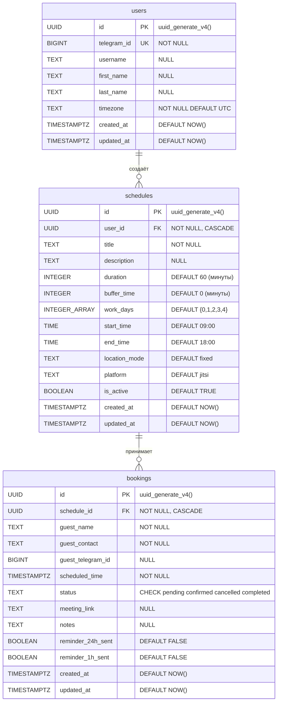
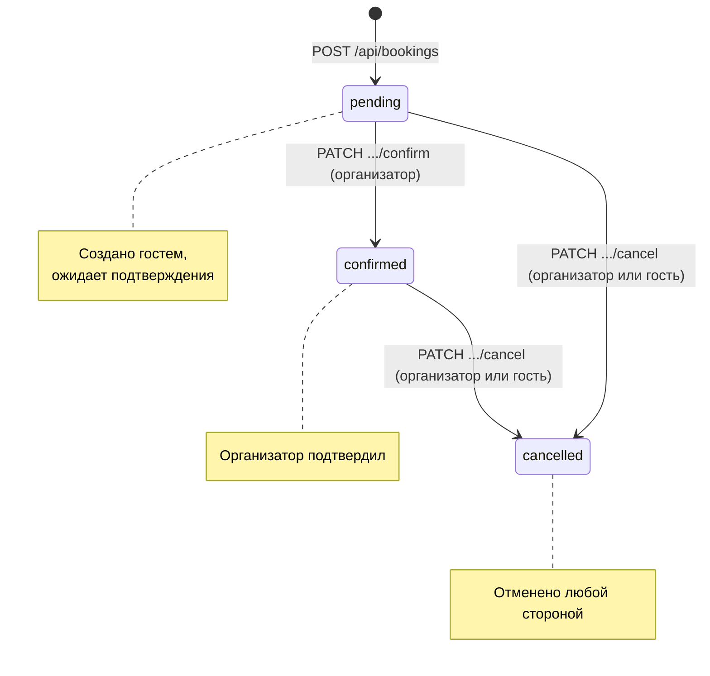

# Модели данных

## ER-диаграмма

## Таблицы базы данных

Определены в `database/init.sql`. Расширение: `uuid-ossp`.

### users

Пользователи-организаторы. Создаются при первом `/start` или открытии Mini App.

| Поле | Тип | Ограничение | Описание |
|------|-----|-------------|---------|
| id | UUID | PK, DEFAULT uuid_generate_v4() | Внутренний идентификатор |
| telegram_id | BIGINT | UNIQUE NOT NULL | Telegram user ID |
| username | TEXT | NULL | Username в Telegram (@handle) |
| first_name | TEXT | NULL | Имя из Telegram |
| last_name | TEXT | NULL | Фамилия из Telegram |
| timezone | TEXT | NOT NULL, DEFAULT 'UTC' | IANA-таймзона пользователя |
| created_at | TIMESTAMPTZ | NOT NULL, DEFAULT NOW() | Время регистрации |
| updated_at | TIMESTAMPTZ | NOT NULL, DEFAULT NOW() | Время последнего обновления |

**Индексы:** `idx_users_telegram_id` ON (telegram_id)

**Особенности:** при повторной авторизации (POST `/api/users/auth`) — UPSERT: обновляет username, first_name, last_name, timezone.

**Миграция:** `database/migrations/002_add_timezone.sql` — добавление колонки timezone.

### schedules

Расписания для бронирования. Организатор может создать несколько расписаний.

| Поле | Тип | Ограничение | Описание |
|------|-----|-------------|---------|
| id | UUID | PK, DEFAULT uuid_generate_v4() | Идентификатор расписания |
| user_id | UUID | FK → users(id) ON DELETE CASCADE, NOT NULL | Владелец-организатор |
| title | TEXT | NOT NULL | Название расписания |
| description | TEXT | NULL | Описание |
| duration | INTEGER | NOT NULL, DEFAULT 60 | Длительность встречи (минуты) |
| buffer_time | INTEGER | NOT NULL, DEFAULT 0 | Перерыв между встречами (минуты) |
| work_days | INTEGER[] | NOT NULL, DEFAULT '{0,1,2,3,4}' | Рабочие дни (0=Пн, 6=Вс) |
| start_time | TIME | NOT NULL, DEFAULT '09:00' | Начало рабочего дня |
| end_time | TIME | NOT NULL, DEFAULT '18:00' | Конец рабочего дня |
| location_mode | TEXT | NOT NULL, DEFAULT 'fixed' | Режим выбора платформы (fixed / user_choice) |
| platform | TEXT | NOT NULL, DEFAULT 'jitsi' | Платформа по умолчанию |
| is_active | BOOLEAN | NOT NULL, DEFAULT TRUE | Активно ли расписание |
| created_at | TIMESTAMPTZ | NOT NULL, DEFAULT NOW() | Время создания |
| updated_at | TIMESTAMPTZ | NOT NULL, DEFAULT NOW() | Время обновления |

**Индексы:**
- `idx_schedules_user_id` ON (user_id)
- `idx_schedules_is_active` ON (is_active)

**Особенности:**
- Удаление мягкое: `is_active = FALSE`. Данные остаются в БД.
- `work_days` — массив целых чисел PostgreSQL: `{0,1,2,3,4}` = Пн-Пт.
- Допустимые значения `platform`: `jitsi`, `zoom`, `other`.
- `location_mode = 'user_choice'` позволяет гостю выбрать платформу при бронировании.

### bookings

Бронирования встреч. Создаются гостями через Mini App или напрямую через API.

| Поле | Тип | Ограничение | Описание |
|------|-----|-------------|---------|
| id | UUID | PK, DEFAULT uuid_generate_v4() | Идентификатор бронирования |
| schedule_id | UUID | FK → schedules(id) ON DELETE CASCADE, NOT NULL | К какому расписанию |
| guest_name | TEXT | NOT NULL | Имя гостя |
| guest_contact | TEXT | NOT NULL | Контакт (email или @username) |
| guest_telegram_id | BIGINT | NULL | Telegram ID гостя (если есть) |
| scheduled_time | TIMESTAMPTZ | NOT NULL | Дата и время встречи |
| status | TEXT | NOT NULL, DEFAULT 'pending', CHECK (IN pending/confirmed/cancelled/completed) | Статус бронирования |
| meeting_link | TEXT | NULL | Ссылка на видеозвонок |
| notes | TEXT | NULL | Заметки от гостя |
| reminder_24h_sent | BOOLEAN | NOT NULL, DEFAULT FALSE | Отправлено ли напоминание за 24ч |
| reminder_1h_sent | BOOLEAN | NOT NULL, DEFAULT FALSE | Отправлено ли напоминание за 1ч |
| created_at | TIMESTAMPTZ | NOT NULL, DEFAULT NOW() | Время создания |
| updated_at | TIMESTAMPTZ | NOT NULL, DEFAULT NOW() | Время обновления |

**Индексы:**
- `idx_bookings_schedule_id` ON (schedule_id)
- `idx_bookings_guest_telegram_id` ON (guest_telegram_id)
- `idx_bookings_scheduled_time` ON (scheduled_time)
- `idx_bookings_status` ON (status)

**Миграция:** `database/migrations/003_add_reminder_flags.sql` — добавление reminder-флагов.

## Жизненный цикл бронирования

**Кто меняет статус:**

| Переход | Кто может | Эндпоинт |
|---------|----------|----------|
| pending → confirmed | Только организатор | PATCH `/api/bookings/{id}/confirm?telegram_id=` |
| pending → cancelled | Организатор или гость | PATCH `/api/bookings/{id}/cancel?telegram_id=` |
| confirmed → cancelled | Организатор или гость | PATCH `/api/bookings/{id}/cancel?telegram_id=` |

**Примечание:** статус `completed` используется во фронтенде для визуального отображения прошедших встреч, но не устанавливается в БД — нет автоматического перехода confirmed → completed.

## View: bookings_detail

Денормализованное представление для чтения бронирований с деталями расписания и организатора.

| Поле | Источник | Описание |
|------|---------|----------|
| * (все поля bookings) | bookings | Все данные бронирования |
| schedule_title | schedules.title | Название расписания |
| schedule_duration | schedules.duration | Длительность встречи |
| schedule_platform | schedules.platform | Платформа |
| organizer_user_id | schedules.user_id | UUID организатора |
| organizer_telegram_id | users.telegram_id | Telegram ID организатора |
| organizer_first_name | users.first_name | Имя организатора |
| organizer_username | users.username | Username организатора |

## Pydantic-схемы (Backend)

Определены в `backend/main.py`, строки ~148–177.

### UserAuth (запрос: POST `/api/users/auth`)

`telegram_id` больше **не** передаётся в теле запроса — извлекается из `X-Init-Data` через `Depends(get_current_user)`.

| Поле | Тип | Валидация | Описание |
|------|-----|-----------|---------|
| username | Optional[str] | max_length=100 | Username в Telegram |
| first_name | Optional[str] | max_length=200 | Имя |
| last_name | Optional[str] | max_length=200 | Фамилия |
| timezone | Optional[str] | default="UTC" | IANA-таймзона (валидируется через `zoneinfo.available_timezones()`) |

### ScheduleCreate (запрос: POST `/api/schedules`)

`telegram_id` больше **не** передаётся — извлекается из auth.

| Поле | Тип | Валидация | Default | Описание |
|------|-----|-----------|---------|---------|
| title | str | min=1, max=200 | — | Название расписания |
| description | Optional[str] | max=2000 | None | Описание |
| duration | int | ge=5, le=480 | 60 | Длительность встречи (мин) |
| buffer_time | int | ge=0, le=120 | 0 | Буфер между встречами (мин) |
| work_days | List[int] | — | [0,1,2,3,4] | Рабочие дни (0=Пн, 6=Вс) |
| start_time | str | pattern `^\d{2}:\d{2}$` | "09:00" | Начало рабочего дня (HH:MM) |
| end_time | str | pattern `^\d{2}:\d{2}$` | "18:00" | Конец рабочего дня (HH:MM) |
| location_mode | str | max=50 | "fixed" | Режим выбора платформы |
| platform | str | max=50 | "jitsi" | Платформа |

### BookingCreate (запрос: POST `/api/bookings`)

| Поле | Тип | Валидация | Описание |
|------|-----|-----------|---------|
| schedule_id | str | max=50 | UUID расписания (строка) |
| guest_name | str | min=1, max=200 | Имя гостя |
| guest_contact | str | min=1, max=200 | Email или @username |
| guest_telegram_id | Optional[int] | — | Telegram ID гостя (предпочитается из initData) |
| scheduled_time | str | max=50 | ISO-формат даты/времени |
| notes | Optional[str] | max=2000 | Заметки |

### Ответы API

Ответы не формализованы в Pydantic Response-моделях. Backend возвращает `dict` из asyncpg Record
через хелперы `row_to_dict()` / `rows_to_list()`. Структура ответа повторяет структуру таблицы.

Для GET `/api/bookings` ответ дополняется вычисляемым полем `my_role` ('organizer' | 'guest')
через SQL CASE.

## Telegram InitData

Данные из Telegram WebApp SDK, используемые системой:

| Поле | Сохраняется в | Описание |
|------|--------------|---------|
| user.id | users.telegram_id | Уникальный Telegram ID |
| user.username | users.username | @handle пользователя |
| user.first_name | users.first_name | Имя |
| user.last_name | users.last_name | Фамилия |

**Валидация InitData:**
Реализована в `backend/main.py` → `validate_init_data()`. Алгоритм по
[документации Telegram](https://core.telegram.org/bots/webapps#validating-data-received-via-the-mini-app):
1. Разобрать query string, извлечь `hash`
2. Отсортировать оставшиеся пары `key=value` по ключу
3. HMAC-SHA256: `secret = HMAC(b"WebAppData", BOT_TOKEN)`, `hash = HMAC(secret, data_check_string)`
4. Сравнить `hash` с переданным (timing-safe `hmac.compare_digest`)
5. Проверить `auth_date` — отклонять если старше 24 часов
6. Извлечь объект `user` из JSON
