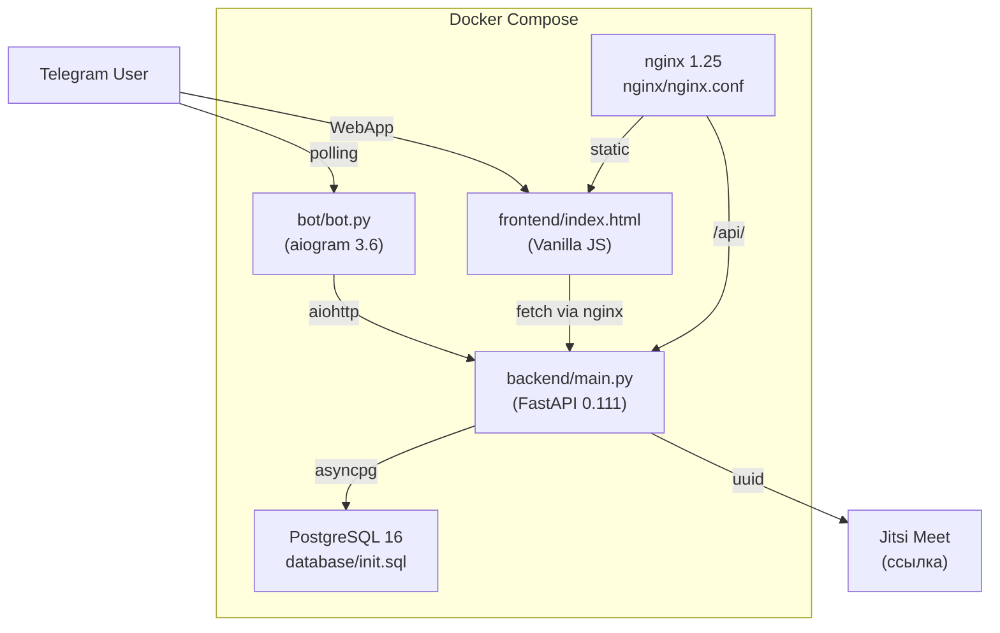

# Описание модулей

## Общая структура

Проект состоит из трёх сервисов, каждый представлен **одним файлом**:

| Сервис | Файл | Строк | Назначение |
|--------|------|-------|-----------|
| Backend | `backend/main.py` | ~497 | FastAPI app: роуты, модели, БД-запросы |
| Bot | `bot/bot.py` | ~573 | aiogram: handlers, FSM, клавиатуры |
| Frontend | `frontend/index.html` | ~2200 | HTML + CSS + JS: SPA Mini App |

---

## Backend (`backend/main.py`)

### Инициализация и конфигурация (строки 1–63)

- **Logging:** `logging.basicConfig`, уровень INFO
- **DATABASE_URL:** из `os.environ["DATABASE_URL"]`
- **Connection pool:** `asyncpg.create_pool(min_size=2, max_size=10)` в `lifespan()`
- **CORS:** `allow_origins=["*"]`, all methods/headers
- **App:** `FastAPI(title="До встречи API", version="2.0.0")`

### Pydantic-модели (строки 69–93)

| Модель | Назначение |
|--------|-----------|
| `UserAuth` | Запрос: POST `/api/users/auth` |
| `ScheduleCreate` | Запрос: POST `/api/schedules` |
| `BookingCreate` | Запрос: POST `/api/bookings` |

### Утилиты (строки 95–112)

| Функция | Описание |
|---------|----------|
| `row_to_dict(row)` | asyncpg Record → Python dict |
| `rows_to_list(rows)` | Список Records → список dict |
| `generate_meeting_link(platform)` | Генерация Jitsi URL: `https://meet.jit.si/dovstrechi-{uuid[:12]}` |

### Роуты: Health (строки 118–128)

| Функция | Роут | Описание |
|---------|------|----------|
| `root()` | GET `/` | Возвращает JSON с названием, версией, статусом |
| `health()` | GET `/health` | `SELECT 1` для проверки подключения к БД |

### Роуты: Users (строки 134–156)

| Функция | Роут | SQL | Описание |
|---------|------|-----|----------|
| `auth_user()` | POST `/api/users/auth` | INSERT ON CONFLICT UPDATE | Upsert пользователя по telegram_id |
| `get_user()` | GET `/api/users/{telegram_id}` | SELECT WHERE telegram_id | Получить пользователя |

### Роуты: Schedules (строки 162–237)

| Функция | Роут | SQL | Описание |
|---------|------|-----|----------|
| `create_schedule()` | POST `/api/schedules` | SELECT user → INSERT schedules | Создать расписание |
| `list_schedules()` | GET `/api/schedules` | SELECT JOIN users WHERE telegram_id, is_active | Список расписаний |
| `get_schedule()` | GET `/api/schedules/{id}` | SELECT WHERE id, is_active | Детали расписания |
| `delete_schedule()` | DELETE `/api/schedules/{id}` | UPDATE SET is_active=FALSE | Мягкое удаление |

### Роуты: Available slots (строки 243–295)

| Функция | Роут | Описание |
|---------|------|----------|
| `available_slots()` | GET `/api/available-slots/{id}` | Вычисляет свободные слоты на дату |

**Алгоритм расчёта слотов:**
1. Проверить, что дата — рабочий день (`work_days`)
2. Получить уже забронированные времена (status != cancelled)
3. Генерировать слоты от `start_time` до `end_time` с шагом `duration + buffer_time`
4. Отфильтровать: прошедшие и забронированные
5. Вернуть массив `{time: "HH:MM", datetime: "ISO"}`

### Роуты: Bookings (строки 301–468)

| Функция | Роут | SQL | Описание |
|---------|------|-----|----------|
| `create_booking()` | POST `/api/bookings` | CHECK conflict → INSERT | Создать бронирование, генерация meeting_link |
| `list_bookings()` | GET `/api/bookings` | SELECT JOIN + CASE my_role | Список бронирований с фильтром role |
| `confirm_booking()` | PATCH `/api/bookings/{id}/confirm` | UPDATE status='confirmed' | Подтвердить (только организатор) |
| `cancel_booking()` | PATCH `/api/bookings/{id}/cancel` | UPDATE status='cancelled' | Отменить (организатор или гость) |

### Роуты: Stats (строки 476–496)

| Функция | Роут | Описание |
|---------|------|----------|
| `get_stats()` | GET `/api/stats` | Агрегация: active_schedules, total/pending/confirmed/upcoming bookings |

### Dependency Injection

- `db()` — async generator, выдаёт `asyncpg.Connection` из пула через `Depends(db)`

---

## Bot (`bot/bot.py`)

### Конфигурация (строки 1–31)

- **BOT_TOKEN:** из `os.environ["BOT_TOKEN"]`
- **BACKEND_URL:** из `BACKEND_API_URL` (default: `http://backend:8000`)
- **MINI_APP_URL:** из env (default: `https://YOUR_DOMAIN.ru`)

### FSM States (строки 36–43)

```
CreateSchedule (StatesGroup):
    title → duration → buffer_time → work_days → start_time → end_time → platform
```

### API-хелпер (строки 49–61)

| Функция | Описание |
|---------|----------|
| `api(method, path, **kwargs)` | Универсальный HTTP-клиент (aiohttp). Возвращает JSON на 200/201, None на ошибке |

### Клавиатуры (строки 67–123)

| Функция | Описание |
|---------|----------|
| `kb_main(mini_app_url)` | Главное меню: 5 кнопок (WebApp + 4 callback) |
| `kb_back_main()` | Кнопка «Главное меню» |
| `kb_duration()` | 6 вариантов длительности (15/30/45/60/90/120 мин) |
| `kb_buffer()` | 4 варианта буфера (0/10/15/30 мин) |
| `kb_platform()` | 3 платформы (Jitsi/Zoom/Офлайн) |
| `kb_schedule_actions(schedule_id, url)` | Действия с расписанием (открыть/поделиться/удалить) |
| `kb_booking_actions(booking_id, status)` | Действия с бронированием (подтвердить/отменить, зависят от status) |

### Хелперы форматирования (строки 129–155)

| Функция / Константа | Описание |
|---------------------|----------|
| `STATUS_EMOJI` | dict: pending→⏳, confirmed→✅, cancelled→❌, completed→✓ |
| `STATUS_TEXT` | dict: pending→Ожидает, confirmed→Подтверждена и т.д. |
| `DAYS_RU` | ["Пн", "Вт", "Ср", "Чт", "Пт", "Сб", "Вс"] |
| `format_dt(dt_str)` | ISO datetime → "DD.MM.YYYY HH:MM" |
| `format_booking(b, show_role)` | Форматирование карточки бронирования (HTML) |

### Handlers (строки 161–538)

#### Команды

| Handler | Фильтр | API-вызовы | Описание |
|---------|--------|-----------|----------|
| `cmd_start()` | `CommandStart()` | POST `/api/users/auth` | Регистрация + главное меню |
| `cmd_help()` | `Command("help")` | — | Справка |

#### Callbacks: навигация

| Handler | Фильтр | API-вызовы | Описание |
|---------|--------|-----------|----------|
| `cb_main_menu()` | `F.data == "main_menu"` | — | Возврат в главное меню |
| `cb_my_schedules()` | `F.data == "my_schedules"` | GET `/api/schedules` | Список расписаний |
| `cb_my_bookings()` | `F.data == "my_bookings"` | GET `/api/bookings` | Список встреч (лимит 10) |
| `cb_stats()` | `F.data == "stats"` | GET `/api/stats` | Статистика |

#### Callbacks: расписания

| Handler | Фильтр | API-вызовы | Описание |
|---------|--------|-----------|----------|
| `cb_schedule_detail()` | `F.data.startswith("schedule_")` | GET `/api/schedules/{id}` | Детали расписания |
| `cb_share_schedule()` | `F.data.startswith("share_")` | — | Отправка ссылки для бронирования |
| `cb_delete_schedule()` | `F.data.startswith("del_")` | DELETE `/api/schedules/{id}` | Удаление расписания |

#### Callbacks: бронирования

| Handler | Фильтр | API-вызовы | Описание |
|---------|--------|-----------|----------|
| `cb_booking_detail()` | `F.data.startswith("booking_")` | GET `/api/bookings` | Детали бронирования |
| `cb_confirm_booking()` | `F.data.startswith("confirm_")` | PATCH `.../confirm` | Подтвердить встречу |
| `cb_cancel_booking()` | `F.data.startswith("cancel_")` | PATCH `.../cancel` | Отменить встречу |

#### FSM: создание расписания

| Handler | Состояние | Ввод | API-вызовы |
|---------|----------|------|-----------|
| `cb_create_schedule()` | → title | callback | — |
| `fsm_title()` | title → duration | текст | — |
| `fsm_duration()` | duration → buffer_time | `dur_*` callback | — |
| `fsm_buffer()` | buffer_time → work_days | `buf_*` callback | — |
| `fsm_work_days()` | work_days → start_time | текст (числа) | — |
| `fsm_start_time()` | start_time → end_time | текст (HH:MM) | — |
| `fsm_end_time()` | end_time → platform | текст (HH:MM) | — |
| `fsm_platform()` | platform → done | `plat_*` callback | POST `/api/schedules` |

### Main (строки 544–573)

| Функция | Описание |
|---------|----------|
| `setup_bot_commands(bot)` | Регистрация /start, /help + MenuButtonWebApp |
| `main()` | Создание Bot + Dispatcher(MemoryStorage) → start_polling(skip_updates=True) |

---

## Frontend (`frontend/index.html`)

### Структура файла

| Секция | Строки (прибл.) | Описание |
|--------|-----------------|----------|
| CSS | 1–960 | Стили: CSS variables, компоненты, анимации |
| HTML | 960–1240 | 8 экранов, модалки, bottom nav, toast |
| JS: константы | 1245–1310 | BACKEND URL, PLATFORMS, месяцы, дни, state |
| JS: init | 1314–1360 | Инициализация: Telegram SDK, auth, роутинг |
| JS: навигация | 1362–1456 | showScreen, goBack, switchNav, navigateRoot |
| JS: API | 1458–1468 | apiFetch(method, path, body) |
| JS: календарь | 1470–1720 | loadSchedule, renderCalendar, slots loading |
| JS: форма | 1720–1840 | setupForm, валидация, submitBooking |
| JS: успех | 1840–1920 | renderSuccess, копирование ссылки |
| JS: встречи | 1920–2080 | loadMeetings, renderMeetingsList, табы |
| JS: детали | 2080–2130 | renderDetail |
| JS: расписания | 2130–2170 | loadSchedules, удаление |
| JS: настройки | 2170–2200 | toggleSetting, localStorage |

### Ключевые функции

#### Навигация

| Функция | Описание |
|---------|----------|
| `showScreen(screenId, push)` | Переход на экран с анимацией, управление BackButton |
| `goBack()` | Возврат по стеку `screenStack` |
| `switchNav(tab)` | Переключение tab в bottom nav (home/meetings/schedules/settings) |
| `navigateRoot()` | Сброс на home, очистка стека |

#### API

| Функция | Описание |
|---------|----------|
| `apiFetch(method, path, body)` | fetch() обёртка: JSON body, parse response, throw on error |
| `authUser()` | POST `/api/users/auth` с данными из Telegram SDK |

#### Календарь и слоты

| Функция | Вызывает API | Описание |
|---------|-------------|----------|
| `loadSchedule(id)` | GET `/api/schedules/{id}` | Загрузка расписания, переход на экран calendar |
| `loadMonthSlots()` | GET `/api/available-slots/{id}` | Загрузка слотов на все рабочие дни месяца (батчами по 8) |
| `renderCalendar()` | — | Рендер месячной сетки с цветовой разметкой дней |
| `selectDay(dateStr)` | GET `/api/available-slots/{id}` | Загрузка слотов на выбранный день |
| `selectTime(time)` | — | Выбор конкретного времени |
| `changeMonth(dir)` | — | Переключение месяца ±1 |
| `calcTotalSlots(schedule)` | — | Расчёт теоретического кол-ва слотов за день |

#### Форма бронирования

| Функция | Вызывает API | Описание |
|---------|-------------|----------|
| `setupForm()` | — | Настройка формы: валидация, платформы |
| `submitBooking()` | POST `/api/bookings` | Отправка бронирования |
| `renderSuccess(booking)` | — | Экран подтверждения с meeting_link |

#### Встречи и расписания

| Функция | Вызывает API | Описание |
|---------|-------------|----------|
| `loadMeetings()` | GET `/api/bookings` | Загрузка встреч пользователя |
| `renderMeetingsList()` | — | Рендер списка с табами (upcoming/history/all) |
| `renderDetail(meetingId)` | — | Детали встречи |
| `loadSchedules()` | GET `/api/schedules` | Загрузка расписаний организатора |
| `confirmCancel(id)` | PATCH `.../cancel` | Отмена встречи |
| `confirmDeleteSchedule(id)` | DELETE `/api/schedules/{id}` | Удаление расписания |

#### Утилиты

| Функция | Описание |
|---------|----------|
| `formatDate(date)` | Date → "YYYY-MM-DD" |
| `formatDateTime(date)` | Date → "D MONTH, HH:MM" |
| `getPlatformName(id)` | ID платформы → человекочитаемое имя |
| `escHtml(str)` | Экранирование HTML-спецсимволов |
| `copyText(text)` | Копирование в буфер обмена |
| `showToast(msg, type)` | Уведомление (3 сек, auto-hide) |

### Глобальное состояние (`state`)

| Поле | Тип | Описание |
|------|-----|---------|
| currentScreen | string | Текущий экран |
| screenStack | string[] | История навигации |
| schedule | object | Загруженное расписание |
| selectedDate | string | Выбранная дата (YYYY-MM-DD) |
| selectedTime | string | Выбранное время (HH:MM) |
| selectedPlatform | string | Выбранная платформа |
| currentMonth | Date | Текущий месяц в календаре |
| monthSlots | object | Кеш слотов: dateStr → {free, total} |
| allMeetings | array | Загруженные встречи |
| allSchedules | array | Загруженные расписания |
| currentTab | string | Текущий таб встреч (upcoming/history/all) |
| pendingCancelId | string | ID для модалки отмены |
| pendingDeleteId | string | ID для модалки удаления |
| meetingLink | string | Ссылка на встречу для копирования |
| settings | object | Настройки уведомлений |

### LocalStorage

| Ключ | Описание |
|------|----------|
| `sb_settings` | JSON: `{notif: bool, '24h': bool, '1h': bool}` — настройки уведомлений |

---

## Граф зависимостей


