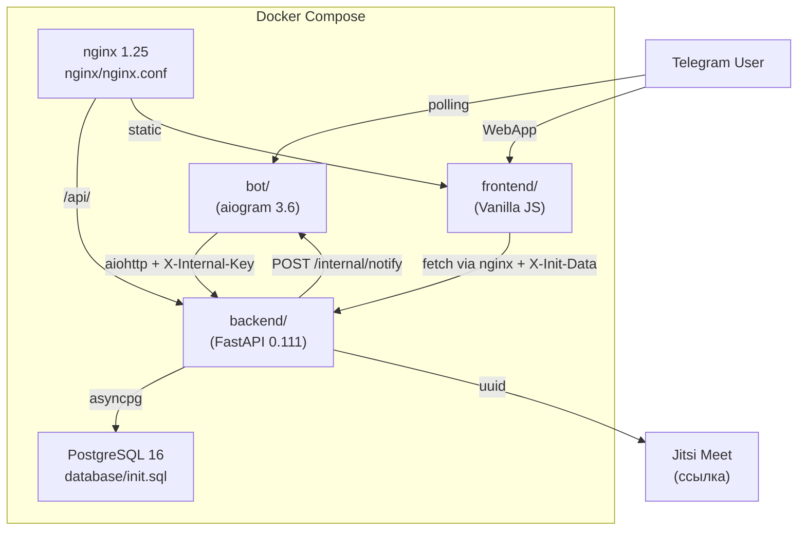

# Описание модулей

> Последнее обновление: 15.04.2026

## Общая структура

| Модуль | Назначение |
|--------|-----------|
| `backend/` | FastAPI REST API — auth, роуты, БД-запросы, structlog, event tracking |
| `backend/main.py` | ~140 строк: app, lifespan, middleware, healthcheck |
| `backend/routers/` | 7 файлов: users, schedules, bookings, meetings, stats, admin, calendar |
| `backend/auth.py` | Telegram initData HMAC + admin cookie sessions |
| `backend/schemas.py` | Pydantic-модели запросов и ответов |
| `backend/utils.py` | row_to_dict, generate_meeting_link, _notify_bot, _track_event |
| `backend/database.py` | asyncpg connection pool + dependency db() |
| `bot/` | aiogram Telegram-бот + aiohttp HTTP-сервер уведомлений |
| `bot/bot.py` | ~70 строк: Bot init, router includes, lifespan |
| `bot/handlers/` | 6 файлов: start, navigation, schedules, bookings, create (FSM), inline |
| `bot/services/` | notifications.py (aiohttp :8080), reminders.py (фоновый цикл) |
| `bot/keyboards.py` | Все клавиатуры (Reply + Inline) |
| `bot/formatters.py` | format_dt, STATUS_EMOJI, format_booking |
| `bot/states.py` | CreateSchedule FSM StatesGroup |
| `bot/api.py` | HTTP helper с auto X-Internal-Key |
| `frontend/` | Telegram Mini App SPA |
| `frontend/index.html` | HTML-разметка |
| `frontend/css/style.css` | Все стили |
| `frontend/js/` | 10 модулей: api, state, config, utils, nav, bookings, schedules, calendar, quickadd, profile |
| `admin/` | Внутренняя SPA-панель администратора |
| `admin/index.html` | HTML-разметка |
| `admin/css/admin.css` | Все стили |
| `admin/js/` | 6 модулей: config, auth, dashboard, logs, tasks, settings |
| `support-bot/` | Отдельный Telegram-бот поддержки (@dovstrechi_support_bot) |
| `support-bot/bot.py` | Основная логика: /start, /help, /stats, пересылка сообщений админу, ответ через reply |
| `support-bot/config.py` | SUPPORT_BOT_TOKEN, ADMIN_CHAT_ID, ADMIN_IDS |

---

## Backend (`backend/`)

### Инициализация и конфигурация (`main.py`, `config.py`, `database.py`)

- **Structlog:** JSON-логи с contextvars (request_id, method, path, duration_ms) — машиночитаемый формат для Docker
- **Env:** `DATABASE_URL`, `BOT_TOKEN`, `INTERNAL_API_KEY`, `BOT_INTERNAL_URL`, `MINI_APP_URL` + `ADMIN_TELEGRAM_ID`, `ADMIN_SESSION_TTL_HOURS`, `ADMIN_IP_ALLOWLIST`, `ANONYMIZE_SALT`
- **Auth (Mini App):** `validate_init_data()` — HMAC-SHA256 по Telegram initData. Dependency: `get_current_user()`, `get_optional_user()`
- **Auth (Admin):** `verify_telegram_login()` — Login Widget HMAC. `create_admin_session()`, `validate_admin_session()`. Dependency: `get_admin_user()`
- **Middleware:** `StructlogMiddleware` — request context (request_id, метод, путь); логирует только не-health запросы; добавляет `X-Request-ID` в ответ
- **Connection pool:** `asyncpg.create_pool(min_size=2, max_size=10)` в `lifespan()`
- **CORS:** whitelist `dovstrechiapp.ru`, methods GET/POST/PATCH/DELETE
- **App:** `FastAPI(title="До встречи API", version="2.0.0")`
- **`_start_time`:** глобальная переменная для расчёта uptime

### Pydantic-модели (`schemas.py`)

| Модель | Назначение |
|--------|-----------|
| `UserAuth` | POST `/api/users/auth` |
| `ScheduleCreate` | POST `/api/schedules` |
| `ScheduleUpdate` | PATCH `/api/schedules/{id}` |
| `BookingCreate` | POST `/api/bookings` |
| `TelegramLoginData` | POST `/api/admin/auth/login` — Telegram Login Widget payload |
| `TaskCreate` | POST `/api/admin/tasks` |
| `TaskUpdate` | PATCH `/api/admin/tasks/{id}` |
| `TaskReorder` | PATCH `/api/admin/tasks/reorder` |
| `AppEvent` | POST `/api/events` — public event tracking |
| `CleanupRequest` | POST `/api/admin/maintenance/cleanup-events` |

### Утилиты (`utils.py`)

| Функция | Описание |
|---------|----------|
| `row_to_dict(row)` | asyncpg Record → Python dict |
| `rows_to_list(rows)` | Список Records → список dict |
| `generate_meeting_link(platform)` | Генерация Jitsi URL: `https://meet.jit.si/dovstrechi-{uuid[:12]}` |
| `_notify_bot_new_booking(**kwargs)` | Fire-and-forget POST в бот (httpx) — уведомление о новом бронировании |
| `_track_event(conn, event_type, telegram_id, metadata, severity)` | Запись в `app_events` с анонимизацией ID; try/except — не ломает запрос |
| `anonymize_id(telegram_id)` | SHA256(`{id}:{ANONYMIZE_SALT}`)[:12] — необратимая анонимизация |
| `log_admin_action(action, ip, details, conn)` | INSERT в `admin_audit_log` |
| `verify_telegram_login(auth_data)` | HMAC-SHA256 верификация Telegram Login Widget данных |
| `create_admin_session(telegram_id, ip, user_agent, conn)` | Деактивация старых сессий + создание новой + аудит |
| `validate_admin_session(token, conn)` | Проверка токена: активна, не истекла, принадлежит admin |
| `_check_login_rate_limit(ip)` | In-memory rate limit: >3 попыток за 5 мин → True |

### Роуты: Health (`main.py`)

| Функция | Роут | Описание |
|---------|------|----------|
| `root()` | GET `/` | Возвращает JSON с названием, версией, статусом |
| `health()` | GET `/health` | `SELECT 1` для проверки подключения к БД |

### Роуты: Users (`routers/users.py`)

| Функция | Роут | Auth | SQL | Описание |
|---------|------|------|-----|----------|
| `auth_user()` | POST `/api/users/auth` | `get_current_user` | INSERT ON CONFLICT UPDATE (+ timezone) | Upsert пользователя |
| `get_user()` | GET `/api/users/{telegram_id}` | — | SELECT WHERE telegram_id | Получить пользователя |

### Роуты: Schedules (`routers/schedules.py`)

| Функция | Роут | Auth | SQL | Описание |
|---------|------|------|-----|----------|
| `create_schedule()` | POST `/api/schedules` | `get_current_user` | SELECT user → INSERT schedules | Создать расписание |
| `list_schedules()` | GET `/api/schedules` | `get_current_user` | SELECT JOIN users WHERE telegram_id, is_active | Список расписаний |
| `get_schedule()` | GET `/api/schedules/{id}` | — | SELECT WHERE id, is_active | Детали расписания |
| `delete_schedule()` | DELETE `/api/schedules/{id}` | `get_current_user` | UPDATE SET is_active=FALSE | Мягкое удаление |

### Роуты: Available slots (`routers/schedules.py`)

| Функция | Роут | Описание |
|---------|------|----------|
| `available_slots()` | GET `/api/available-slots/{id}` | Вычисляет свободные слоты на дату |

**Алгоритм расчёта слотов (с поддержкой таймзон):**
1. Загрузить расписание + таймзону организатора (`users.timezone`)
2. Проверить, что дата — рабочий день (`work_days`)
3. Сгенерировать слоты в зоне организатора (`org_tz`), перевести в UTC для сравнения
4. Загрузить бронирования в UTC-диапазоне рабочего дня (status != cancelled)
5. Отфильтровать: прошедшие и забронированные
6. Вернуть массив `{time, datetime, datetime_utc, datetime_local}` — `datetime_local` в `viewer_tz`

### Роуты: Bookings (`routers/bookings.py`)

| Функция | Роут | Auth | SQL | Описание |
|---------|------|------|-----|----------|
| `create_booking()` | POST `/api/bookings` | `get_optional_user` | CHECK conflict → INSERT | Создать бронирование + push уведомление |
| `list_bookings()` | GET `/api/bookings` | `get_current_user` | SELECT JOIN + CASE my_role | Список бронирований с фильтром role |
| `get_booking()` | GET `/api/bookings/{id}` | `get_optional_user` | SELECT + my_role | Детали одного бронирования |
| `confirm_booking()` | PATCH `/api/bookings/{id}/confirm` | `get_current_user` | UPDATE status='confirmed' | Подтвердить (только организатор) |
| `cancel_booking()` | PATCH `/api/bookings/{id}/cancel` | `get_current_user` | UPDATE status='cancelled' | Отменить (организатор или гость) |
| `guest_confirm()` | PATCH `/api/bookings/{id}/guest-confirm` | — | UPDATE status='confirmed' | Гость подтверждает встречу (morning confirmation) |
| `get_confirmation_requests()` | GET `/api/bookings/confirmation-requests` | — | SELECT confirmed bookings на сегодня без guest-confirm | Список бронирований для утреннего запроса подтверждения |
| `get_no_answer_candidates()` | GET `/api/bookings/no-answer-candidates` | — | SELECT confirmation_asked + без ответа >1ч | Кандидаты на статус no_answer |
| `set_confirmation_asked()` | PATCH `/api/bookings/{id}/confirmation-asked` | — | UPDATE confirmation_asked_at | Отметить, что запрос подтверждения отправлен |
| `set_no_answer()` | PATCH `/api/bookings/{id}/set-no-answer` | — | UPDATE status='no_answer' | Установить статус no_answer (гость не ответил) |
| `get_pending_reminders_v2()` | GET `/api/bookings/pending-reminders-v2` | — | SELECT с учётом sent_reminders | Список бронирований для напоминаний (v2, через таблицу sent_reminders) |
| `create_sent_reminder()` | POST `/api/bookings/sent-reminders` | — | INSERT в sent_reminders | Записать факт отправки напоминания |

### Роуты: Meetings (`routers/meetings.py`)

| Функция | Роут | Auth | Описание |
|---------|------|------|----------|
| `quick_add_meeting()` | POST `/api/meetings/quick` | `get_current_user` | Создать встречу вручную (личная или в расписание) |
| `get_or_create_default_schedule()` | — | — | Автосоздание скрытого расписания (`is_default=TRUE`) если не передан schedule_id |

### Роуты: Reminders (`routers/bookings.py`)

| Функция | Роут | Описание |
|---------|------|----------|
| `get_pending_reminders()` | GET `/api/bookings/pending-reminders` | Confirmed бронирования в окне reminder_type (24h/1h) с `reminder_*_sent=FALSE` |
| `mark_reminder_sent()` | PATCH `/api/bookings/{id}/reminder-sent` | Пометить reminder как отправленный |

### Роуты: Stats (`routers/stats.py`)

| Функция | Роут | Описание |
|---------|------|----------|
| `get_stats()` | GET `/api/stats` | Агрегация: active_schedules, total/pending/confirmed/upcoming bookings |

### Роуты: Calendar (`routers/calendar.py`)

| Функция | Роут | Auth | Описание |
|---------|------|------|----------|
| `google_auth_url()` | GET `/api/calendar/google/auth-url` | `get_current_user` | Генерация Google OAuth URL для подключения календаря |
| `google_callback()` | GET `/api/calendar/google/callback` | — | Google OAuth callback — обмен code на токены, сохранение аккаунта |
| `list_accounts()` | GET `/api/calendar/accounts` | `get_current_user` | Список подключённых календарных аккаунтов пользователя |
| `delete_account()` | DELETE `/api/calendar/accounts/{id}` | `get_current_user` | Удаление календарного аккаунта |
| `toggle_connection()` | POST `/api/calendar/connections/{id}/toggle` | `get_current_user` | Переключение настроек подключения (check conflicts, push events) |
| `get_calendar_config()` | GET `/api/calendar/schedules/{id}/calendar-config` | `get_current_user` | Получение правил интеграции календаря для расписания |
| `set_calendar_config()` | PUT `/api/calendar/schedules/{id}/calendar-config` | `get_current_user` | Установка правил интеграции календаря для расписания |
| `manual_sync()` | POST `/api/calendar/accounts/{id}/sync` | `get_current_user` | Ручная синхронизация календарного аккаунта |
| `google_webhook()` | POST `/api/calendar/webhook/google` | — | Приём push-уведомлений от Google Calendar API |
| `caldav_connect()` | POST `/api/calendar/caldav/connect` | `get_current_user` | Подключение CalDAV-провайдера (Яндекс, Apple) |
| `external_events()` | GET `/api/calendar/external-events` | `get_current_user` | Внешние события для отображения в расписании |

### Dependency Injection

- `db()` — async generator, выдаёт `asyncpg.Connection` из пула через `Depends(db)`
- `get_current_user(request)` — извлекает пользователя из `X-Init-Data` (HMAC) или `X-Internal-Key`
- `get_optional_user(request)` — то же, но возвращает None при отсутствии auth

---

## Bot (`bot/`)

### Конфигурация (`config.py`, `api.py`)

- **BOT_TOKEN:** из `os.environ["BOT_TOKEN"]`
- **BACKEND_URL:** из `BACKEND_API_URL` (default: `http://backend:8000`)
- **MINI_APP_URL:** из env (default: `https://YOUR_DOMAIN.ru`)
- **INTERNAL_API_KEY:** из env — ключ для бот↔backend аутентификации
- **_bot:** глобальная ссылка на `Bot` инстанс (для отправки уведомлений из aiohttp handlers)

### FSM States (`states.py`)

```
CreateSchedule (StatesGroup):
    title → duration → buffer_time → work_days → start_time → end_time → platform
```

### API-хелпер (`api.py`)

| Функция | Описание |
|---------|----------|
| `api(method, path, **kwargs)` | Универсальный HTTP-клиент (aiohttp, timeout=15s). Автоматически добавляет `X-Internal-Key`. Возвращает JSON на 200/201, None на ошибке |

### Клавиатуры (`keyboards.py`)

| Функция | Описание |
|---------|----------|
| `get_main_keyboard()` | **ReplyKeyboard** — постоянная нижняя панель: 4 кнопки (Создать, Расписания, Встречи, Помощь) |
| `kb_main(mini_app_url)` | InlineKeyboard: главное меню 5 кнопок (WebApp + 4 callback) |
| `kb_back_main()` | Кнопка «Главное меню» |
| `kb_duration()` | 6 вариантов длительности (15/30/45/60/90/120 мин) |
| `kb_buffer()` | 4 варианта буфера (0/10/15/30 мин) |
| `kb_platform()` | 3 платформы (Jitsi/Zoom/Офлайн) |
| `kb_schedule_actions(schedule_id, url)` | Действия с расписанием (открыть/поделиться/удалить) |
| `kb_booking_actions(booking_id, status)` | Действия с бронированием (подтвердить/отменить, зависят от status) |

### Хелперы форматирования (`formatters.py`)

| Функция / Константа | Описание |
|---------------------|----------|
| `STATUS_EMOJI` | dict: pending→⏳, confirmed→✅, cancelled→❌, completed→✓ |
| `STATUS_TEXT` | dict: pending→Ожидает, confirmed→Подтверждена и т.д. |
| `DAYS_RU` | ["Пн", "Вт", "Ср", "Чт", "Пт", "Сб", "Вс"] |
| `format_dt(dt_str, tz="UTC")` | ISO datetime → "DD.MM.YYYY HH:MM" в указанной таймзоне (ZoneInfo) |
| `format_booking(b, show_role)` | Форматирование карточки бронирования (HTML), использует organizer_timezone |

### Handlers (`handlers/`)

#### Команды

| Handler | Фильтр | API-вызовы | Описание |
|---------|--------|-----------|----------|
| `cmd_start()` | `CommandStart()` | POST `/api/users/auth` | Очистка FSM, установка MenuButton per-user, ReplyKeyboard + InlineKeyboard |
| `cmd_help()` | `Command("help")` | — | Справка |

#### Callbacks: навигация

| Handler | Фильтр | API-вызовы | Описание |
|---------|--------|-----------|----------|
| `cb_main_menu()` | `F.data == "main_menu"` | — | Возврат в главное меню |
| `cb_my_schedules()` | `F.data == "my_schedules"` | GET `/api/schedules` | Список расписаний |
| `cb_my_bookings()` | `F.data == "my_bookings"` | GET `/api/bookings` | Список встреч (лимит 10) |
| `cb_stats()` | `F.data == "stats"` | GET `/api/stats` | Статистика |

#### Callbacks: расписания

| Handler | Фильтр | API-вызовы | Описание |
|---------|--------|-----------|----------|
| `cb_schedule_detail()` | `F.data.startswith("schedule_")` | GET `/api/schedules/{id}` | Детали расписания |
| `cb_share_schedule()` | `F.data.startswith("share_")` | — | Отправка ссылки для бронирования |
| `cb_delete_schedule()` | `F.data.startswith("del_")` | DELETE `/api/schedules/{id}` | Удаление расписания |

#### Callbacks: бронирования

| Handler | Фильтр | API-вызовы | Описание |
|---------|--------|-----------|----------|
| `cb_booking_detail()` | `F.data.startswith("booking_")` | GET `/api/bookings` | Детали бронирования |
| `cb_confirm_booking()` | `F.data.startswith("confirm_")` | PATCH `.../confirm` | Подтвердить встречу |
| `cb_cancel_booking()` | `F.data.startswith("cancel_")` | PATCH `.../cancel` | Отменить встречу |

#### FSM: создание расписания

| Handler | Состояние | Ввод | API-вызовы |
|---------|----------|------|-----------|
| `cb_create_schedule()` | → title | callback | — |
| `fsm_title()` | title → duration | текст | — |
| `fsm_duration()` | duration → buffer_time | `dur_*` callback | — |
| `fsm_buffer()` | buffer_time → work_days | `buf_*` callback | — |
| `fsm_work_days()` | work_days → start_time | текст (числа) | — |
| `fsm_start_time()` | start_time → end_time | текст (HH:MM) | — |
| `fsm_end_time()` | end_time → platform | текст (HH:MM) | — |
| `fsm_platform()` | platform → done | `plat_*` callback | POST `/api/schedules` |

#### Reply-кнопки (строки 601–672)

| Handler | Фильтр | API-вызовы | Описание |
|---------|--------|-----------|----------|
| `reply_create_schedule()` | `F.text == "📅 Создать расписание"` | — | Запуск FSM |
| `reply_my_schedules()` | `F.text == "📋 Мои расписания"` | GET `/api/schedules` | Список расписаний |
| `reply_my_bookings()` | `F.text == "👥 Мои встречи"` | GET `/api/bookings` | Список встреч |
| `reply_help()` | `F.text == "❓ Помощь"` | — | Вызов cmd_help |

#### Inline-режим (`handlers/inline.py`)

| Handler | Фильтр | API-вызовы | Описание |
|---------|--------|-----------|----------|
| `handle_inline_query()` | `InlineQuery` | GET `/api/schedules` | Поиск и шаринг расписаний через @bot в любом чате |

#### Callbacks: подтверждение/отмена гостем

| Handler | Фильтр | API-вызовы | Описание |
|---------|--------|-----------|----------|
| `cb_guest_confirm()` | `F.data.startswith("guest_confirm_")` | PATCH `.../guest-confirm` | Гость подтверждает встречу (morning confirmation) |
| `cb_guest_cancel()` | `F.data.startswith("guest_cancel_")` | PATCH `.../cancel` | Гость отменяет встречу |

### Notification server + Reminders (`services/`)

| Функция | Описание |
|---------|----------|
| `setup_bot_commands(bot)` | Регистрация /start, /help + глобальный MenuButtonWebApp (try/except) |
| `handle_new_booking(request)` | aiohttp handler для POST `/internal/notify` — проверка X-Internal-Key, отправка сообщений организатору (с кнопками ✅/❌) и гостю |
| `send_reminder(booking, type)` | Отправка напоминания (24h/1h) организатору и гостю + mark as sent через API |
| `reminder_loop()` | Фоновый цикл (каждые 5 мин) — опрашивает pending-reminders и вызывает send_reminder |

### Main (`bot.py`)

| Функция | Описание |
|---------|----------|
| `main()` | Создание Bot (глобальный `_bot`) + Dispatcher(MemoryStorage) + setup_bot_commands + `asyncio.create_task(reminder_loop)` + aiohttp web server :8080 + start_polling(skip_updates=True) |

---

## Frontend (`frontend/`)

### Структура

| Файл | Назначение |
|------|-----------|
| `index.html` | HTML-разметка: все экраны, модалки, bottom nav |
| `css/style.css` | CSS variables, компоненты, анимации, адаптив |
| `js/config.js` | BACKEND URL, CHANGELOG, MONTHS, APP_VERSION, error boundary |
| `js/state.js` | Глобальное состояние приложения |
| `js/api.js` | apiFetch(), authUser() с X-Init-Data |
| `js/utils.js` | escHtml, formatters, showToast, status badges |
| `js/nav.js` | showScreen(), back(), navTab(), hideNavbar() |
| `js/bookings.js` | loadHome(), loadMeetings(), detail, confirm/cancel |
| `js/schedules.js` | loadSchedules(), pause/resume, delete, archive (localStorage) |
| `js/calendar.js` | Гостевое бронирование: calendar → slot → form → success |
| `js/quickadd.js` | Быстрое добавление встречи организатором |
| `js/profile.js` | Профиль, уведомления, напоминания, timezone, changelog |

### Ключевые функции

#### Навигация

| Функция | Описание |
|---------|----------|
| `showScreen(screenId, push)` | Переход на экран с анимацией, управление BackButton |
| `goBack()` | Возврат по стеку `screenStack` |
| `switchNav(tab)` | Переключение tab в bottom nav (home/meetings/schedules/settings) |
| `navigateRoot()` | Сброс на home, очистка стека |

#### API

| Функция | Описание |
|---------|----------|
| `apiFetch(method, path, body)` | fetch() обёртка: JSON body, parse response, throw on error |
| `authUser()` | POST `/api/users/auth` с данными из Telegram SDK |

#### Календарь и слоты

| Функция | Вызывает API | Описание |
|---------|-------------|----------|
| `loadSchedule(id)` | GET `/api/schedules/{id}` | Загрузка расписания, переход на экран calendar |
| `loadMonthSlots()` | GET `/api/available-slots/{id}` | Загрузка слотов на все рабочие дни месяца (батчами по 8) |
| `renderCalendar()` | — | Рендер месячной сетки с цветовой разметкой дней |
| `selectDay(dateStr)` | GET `/api/available-slots/{id}` | Загрузка слотов на выбранный день |
| `selectTime(time)` | — | Выбор конкретного времени |
| `changeMonth(dir)` | — | Переключение месяца ±1 |
| `calcTotalSlots(schedule)` | — | Расчёт теоретического кол-ва слотов за день |

#### Форма бронирования

| Функция | Вызывает API | Описание |
|---------|-------------|----------|
| `setupForm()` | — | Настройка формы: валидация, платформы |
| `submitBooking()` | POST `/api/bookings` | Отправка бронирования |
| `renderSuccess(booking)` | — | Экран подтверждения с meeting_link |

#### Встречи и расписания

| Функция | Вызывает API | Описание |
|---------|-------------|----------|
| `loadMeetings()` | GET `/api/bookings` | Загрузка встреч пользователя |
| `renderMeetingsList()` | — | Рендер списка с табами (upcoming/history/all) |
| `renderDetail(meetingId)` | — | Детали встречи |
| `loadSchedules()` | GET `/api/schedules` | Загрузка расписаний организатора |
| `confirmCancel(id)` | PATCH `.../cancel` | Отмена встречи |
| `confirmDeleteSchedule(id)` | DELETE `/api/schedules/{id}` | Удаление расписания |

#### Утилиты

| Функция | Описание |
|---------|----------|
| `formatDate(date)` | Date → "YYYY-MM-DD" |
| `formatDateTime(date)` | Date → "D MONTH, HH:MM" |
| `getPlatformName(id)` | ID платформы → человекочитаемое имя |
| `escHtml(str)` | Экранирование HTML-спецсимволов |
| `copyText(text)` | Копирование в буфер обмена |
| `showToast(msg, type)` | Уведомление (3 сек, auto-hide) |

### Глобальное состояние (`state`)

| Поле | Тип | Описание |
|------|-----|---------|
| currentScreen | string | Текущий экран |
| screenStack | string[] | История навигации |
| schedule | object | Загруженное расписание |
| selectedDate | string | Выбранная дата (YYYY-MM-DD) |
| selectedTime | string | Выбранное время (HH:MM) |
| selectedPlatform | string | Выбранная платформа |
| currentMonth | Date | Текущий месяц в календаре |
| monthSlots | object | Кеш слотов: dateStr → {free, total} |
| allMeetings | array | Загруженные встречи |
| allSchedules | array | Загруженные расписания |
| currentTab | string | Текущий таб встреч (upcoming/history/all) |
| pendingCancelId | string | ID для модалки отмены |
| pendingDeleteId | string | ID для модалки удаления |
| meetingLink | string | Ссылка на встречу для копирования |
| settings | object | Настройки уведомлений |

### LocalStorage

| Ключ | Описание |
|------|----------|
| `sb_settings` | JSON: `{notif: bool, '24h': bool, '1h': bool}` — настройки уведомлений |

---

## Admin Panel (`admin/`)

### Архитектура

SPA: `index.html` (разметка) + `css/admin.css` (стили) + `js/` (6 модулей). Зависимости через CDN: Chart.js 4.4.7 (графики), SortableJS 1.15.6 (drag & drop). Навигация: hash-based (`#dashboard`, `#logs`, `#tasks`, `#settings`).

### Экраны

| Экран | Hash | Основные компоненты |
|-------|------|---------------------|
| Login | (пусто) | Telegram Login Widget + fallback, error display |
| Dashboard | `#dashboard` | 6 metric cards с skeleton-loading, line/doughnut/bar Chart.js |
| Logs | `#logs` | Stats bar (4 severities), 6 фильтров, таблица с pagination |
| Tasks | `#tasks` | Kanban 3 колонки, drag & drop, create/edit/delete modals |
| Settings | `#settings` | System info grid, security rows, audit mini-list, maintenance |

### Auth flow

1. При загрузке: `checkSession()` → GET `/api/admin/auth/me`
2. 401 → показать Login screen + загрузить Telegram Login Widget
3. Пользователь нажимает "войти через Telegram" → `onTelegramAuth(user)` callback
4. POST `/api/admin/auth/login` → сервер выставляет cookie `admin_session`
5. Переход на `#dashboard` + `startDashboardRefresh()` (auto-refresh 60s)
6. Logout → POST `/api/admin/auth/logout` + `stopDashboardRefresh()`

### Ключевые функции JavaScript

| Функция | Описание |
|---------|----------|
| `api(method, path, body)` | Единый fetch helper, `credentials: 'same-origin'`, JSON |
| `navigateTo(page)` | Переключение страниц + загрузка данных + обновление sidebar |
| `escHtml(str)` | XSS-защита: `&`, `<`, `>`, `"`, `'` |
| `showNotification(msg, type)` | Toast уведомление (3 сек, auto-hide) |
| `loadDashboard()` | Promise.all 3 API-запросов → metrics + 3 charts |
| `renderTrendChart(data)` | Chart.js line (заливка teal, destroy before recreate) |
| `renderPlatformsChart(data)` | Chart.js doughnut + "Нет данных" fallback |
| `renderWeekdayChart(data)` | Chart.js bar (агрегация из trend, Mon-Fri/Sat-Sun раскраска) |
| `loadLogs()` | Параллельно: stats + paginated logs → renderLogTable + pagination |
| `filterBySeverity(sev)` | Клик по severity badge → фильтрация |
| `filterByUser(anonymousId)` | Клик по user_id в таблице → фильтрация по anonymous_id |
| `debounceFilterLogs()` | Debounce 400ms для search input |
| `loadTasks()` | GET tasks → renderKanban() |
| `initSortable()` | SortableJS группа 'kanban', animation 200ms, onEnd → PATCH status/reorder |
| `renderTaskCard(task)` | XSS-safe HTML с data-атрибутами (не inline onclick) |
| `openTaskModal(taskId?)` | Создание (empty) или редактирование (prefill) задачи |
| `saveTask()` | POST (create) / PATCH (update) с Pydantic-совместимым телом |
| `loadSettings()` | Promise.all: system/info + audit-log → renderSystemInfo + renderAuditMini |
| `invalidateAllSessions()` | confirm() → POST sessions/invalidate-all |
| `cleanupEvents()` | confirm() → POST maintenance/cleanup-events |

### Состояние (глобальные переменные)

| Переменная | Тип | Назначение |
|-----------|-----|-----------|
| `sessionData` | object | Данные текущей сессии (telegram_id, expires_at) |
| `logsState` | object | Страница, фильтры, total для логов |
| `tasksData` | object | `{backlog:[], in_progress:[], done:[]}` |
| `editingTaskId` / `deletingTaskId` | string\|null | ID задачи в модальном окне |
| `currentTags` | string[] | Теги редактируемой задачи |
| `sortableInstances` | Sortable[] | Инстансы SortableJS для очистки при перерендере |
| `dashboardInterval` | number | ID setInterval для auto-refresh |

---

## Support Bot (`support-bot/`)

Отдельный Telegram-бот для сбора обратной связи и поддержки пользователей (@dovstrechi_support_bot). Изолирован от основного бота — запросы поддержки не смешиваются с функциональностью бронирования.

### Конфигурация (`config.py`)

| Переменная | Описание |
|-----------|----------|
| `SUPPORT_BOT_TOKEN` | Токен @dovstrechi_support_bot из BotFather |
| `ADMIN_CHAT_ID` | ID чата/группы для пересылки сообщений администратору |
| `ADMIN_IDS` | Список Telegram ID администраторов, имеющих право отвечать |

### Основная логика (`bot.py`)

| Функция / Handler | Описание |
|-------------------|----------|
| `/start` | Приветственное сообщение с инструкцией |
| `/help` | Справка по использованию бота поддержки |
| `/stats` | Статистика обращений (только для админов) |
| message relay | Пересылка сообщений пользователей в ADMIN_CHAT_ID |
| admin reply handler | Ответ пользователю через reply на пересланное сообщение |

---

## Граф зависимостей


