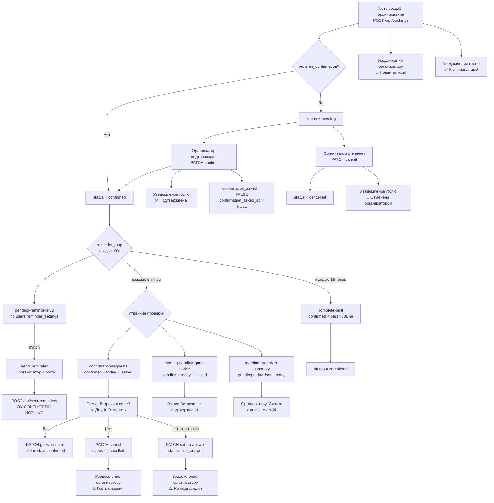

# Аудит системы уведомлений — 2026-04-20

## Executive Summary

- **Всего находок: 16**
- **Critical: 3** | **Major: 7** | **Minor: 6**
- **Топ-3 проблемы, которые ломают UX сильнее всего:**
  1. **FINDING-001** 🔴 Настройки напоминаний во фронтенде никогда не синхронизируются с бэкендом — пользователь выбирает таймер, но бэкенд всегда использует дефолтные 24ч + 1ч.
  2. **FINDING-002** 🔴 Двойная система напоминаний (V1 boolean-флаги + V2 sent_reminders) — V1 мёртвый код, но эндпоинты зарегистрированы и индекс в БД жив.
  3. **FINDING-003** 🔴 12 внутренних эндпоинтов (pending-reminders-v2, sent-reminders, complete-past и др.) не имеют никакой аутентификации — внешний вызов может сломать систему напоминаний.

---

## 1. Inventory

### 1.1 Источники уведомлений

| # | Триггер | Функция / файл | Получатели | Условия |
|---|---------|----------------|------------|---------|
| 1 | Новое бронирование (POST /api/bookings) | `_notify_bot_new_booking()` → `bot/services/notifications.py:handle_new_booking` | Организатор + гость (если есть telegram_id) | Всегда при успешном создании |
| 2 | Подтверждение организатором (PATCH /api/bookings/{id}/confirm) | `_notify_bot_status_change()` → `handle_status_change` | Гость | status → confirmed |
| 3 | Отмена организатором (PATCH /api/bookings/{id}/cancel) | `_notify_bot_status_change()` → `handle_status_change` | Гость | initiator = organizer |
| 4 | Отмена гостем (PATCH /api/bookings/{id}/cancel) | `_notify_bot_status_change()` → `handle_status_change` | Организатор | initiator = guest |
| 5 | Гость подтвердил встречу (утреннее) (PATCH guest-confirm) | `_notify_bot_status_change(new_status="guest_confirmed")` | Организатор | Гость нажал "Да, буду!" |
| 6 | No answer (auto, PATCH set-no-answer) | `_notify_bot_status_change(new_status="no_answer")` | Организатор | confirmation_asked >1ч без ответа |
| 7 | Напоминания V2 (reminder_loop, каждые 60с) | `bot/services/reminders.py:send_reminder` | Организатор + гость | По настройкам `users.reminder_settings` + `sent_reminders` |
| 8 | Утренний запрос "В силе?" (reminder_loop, каждые 5 тиков) | `send_confirmation_request` | Гость | confirmed, today, >=09:00 org TZ, confirmation_asked=FALSE |
| 9 | Утреннее уведомление о pending (reminder_loop) | `send_pending_guest_notice` | Гость | pending, today, >=09:00 org TZ |
| 10 | Утренняя сводка организатору (reminder_loop) | `send_morning_organizer_summary` | Организатор | pending bookings today, summary not sent today |
| 11 | Автозавершение (reminder_loop, каждые 15 тиков) | `POST /api/bookings/complete-past` | Никто (тихий) | confirmed + scheduled_time < NOW() - 30мин |

### 1.2 Эндпоинты

| Метод | Путь | Auth | Описание | Вызывается из |
|-------|------|------|----------|---------------|
| GET | `/api/bookings/pending-reminders?reminder_type=` | **Нет** | V1: поиск по boolean-флагам | **Никем** (мёртвый) |
| GET | `/api/bookings/pending-reminders-v2` | **Нет** | V2: поиск по sent_reminders + reminder_settings | `reminder_loop` |
| GET | `/api/bookings/confirmation-requests` | **Нет** | Confirmed сегодня, confirmation_asked=FALSE | `reminder_loop` |
| GET | `/api/bookings/no-answer-candidates` | **Нет** | confirmation_asked >1ч без ответа | `reminder_loop` |
| GET | `/api/bookings/morning-organizer-summary` | **Нет** | Pending на сегодня, summary не отправлен | `reminder_loop` |
| GET | `/api/bookings/morning-pending-guest-notice` | **Нет** | Pending сегодня, гость не уведомлён | `reminder_loop` |
| PATCH | `/api/bookings/{id}/confirmation-asked` | **Нет** | Пометить confirmation_asked=TRUE | `send_confirmation_request`, `send_pending_guest_notice` |
| PATCH | `/api/bookings/{id}/set-no-answer` | **Нет** | Перевести в no_answer | `reminder_loop` |
| PATCH | `/api/bookings/{id}/reminder-sent?reminder_type=` | **Нет** | V1: пометить boolean-флаг | **Никем** (мёртвый) |
| POST | `/api/sent-reminders` | **Нет** | V2: записать отправленное напоминание | `send_reminder` |
| POST | `/api/bookings/complete-past` | **Нет** | Автозавершение прошедших | `reminder_loop` |
| PATCH | `/api/users/{tid}/morning-summary-sent` | **Нет** | Пометить сводку как отправленную | `send_morning_organizer_summary` |
| PATCH | `/api/users/notification-settings` | initData | Обновить reminder_settings | **Никем** (фронт не вызывает) |
| PATCH | `/api/bookings/{id}/confirm` | initData | Подтвердить бронирование | Бот callback + Mini App |
| PATCH | `/api/bookings/{id}/guest-confirm` | initData | Гость подтверждает (утреннее) | Бот callback |
| PATCH | `/api/bookings/{id}/cancel` | initData | Отменить бронирование | Бот callback + Mini App |

### 1.3 Хранение состояния в БД

#### Таблица `bookings` — boolean-флаги (V1, мёртвые)

| Колонка | Кто пишет | Кто читает |
|---------|-----------|-----------|
| `reminder_24h_sent` | Никто (V1 мёртв) | `GET /pending-reminders?type=24h` (мёртв) |
| `reminder_1h_sent` | Никто | `GET /pending-reminders?type=1h` (мёртв) |
| `reminder_15m_sent` | Никто | `GET /pending-reminders?type=15m` (мёртв) |
| `reminder_5m_sent` | Никто | `GET /pending-reminders?type=5m` (мёртв) |
| `morning_reminder_sent` | Никто | `GET /pending-reminders?type=morning` (мёртв) |
| `confirmation_asked` | `mark_confirmation_asked`, `confirm_booking` (reset) | `confirmation-requests`, `morning-pending-guest-notice` |
| `confirmation_asked_at` | `mark_confirmation_asked`, `confirm_booking` (NULL), `guest_confirm` (NULL) | `no-answer-candidates` (>1ч) |
| `status` | create, confirm, cancel, guest_confirm, set_no_answer, complete_past | Все запросы |

#### Таблица `sent_reminders` (V2, активная)

| Колонка | Кто пишет | Кто читает |
|---------|-----------|-----------|
| `booking_id` + `reminder_type` (UNIQUE) | `POST /api/sent-reminders` из `send_reminder()` | `pending-reminders-v2` (NOT EXISTS subquery) |

#### Колонка `users.reminder_settings` (JSONB)

| Колонка | Default | Кто пишет | Кто читает |
|---------|---------|-----------|-----------|
| `reminder_settings` | `{"reminders":["1440","60"],"customReminders":[]}` | `PATCH /api/users/notification-settings` (**никем не вызывается**) | `pending-reminders-v2` (CTE user_reminder_mins) |

#### Колонка `users.morning_summary_sent_date` (DATE)

| Кто пишет | Кто читает |
|-----------|-----------|
| `PATCH /api/users/{tid}/morning-summary-sent` (ставит CURRENT_DATE) | `morning-organizer-summary` SQL (сравнение с сегодня) |

#### Frontend: `localStorage('sb_settings')`

| Ключ | Описание | Синхронизация с сервером |
|------|----------|------------------------|
| `booking_notif` | Тумблер "Уведомления о записях" | **Нет** |
| `reminder_notif` | Тумблер "Напоминания" | **Нет** |
| `reminders` | Массив выбранных интервалов (напр. `["60","30"]`) | **Нет** |
| `customReminders` | Массив кастомных интервалов | **Нет** |

### 1.4 Шаблоны сообщений

| # | Сценарий | Получатель | Заголовок | Кнопки | Файл:строки |
|---|----------|-----------|-----------|--------|-------------|
| 1 | Новое бронирование | Организатор | "🔔 Новая запись!" | ✅ Подтвердить / ❌ Отклонить (если requires_confirmation) ИЛИ "📱 Открыть приложение" | `notifications.py:83-103` |
| 2 | Новое бронирование | Гость | "✅ Вы записались!" | "🔔 Настроить уведомления" (deep-link) + "📅 Принимать записи самому →" | `notifications.py:123-156` |
| 3 | Подтверждение | Гость | "✅ Встреча подтверждена!" | Нет | `notifications.py:191-201` |
| 4 | Отмена организатором | Гость | "🚫 Встреча отменена организатором." | Нет | `notifications.py:207-212` |
| 5 | Отмена гостем | Организатор | "🚫 Отмена встречи." | Нет | `notifications.py:215-222` |
| 6 | Гость подтвердил (утреннее) | Организатор | "✅ {name} подтвердил(а) встречу!" | Нет | `notifications.py:226-232` |
| 7 | No answer | Организатор | "⚠️ {name} не подтвердил(а) встречу" | Нет | `notifications.py:236-243` |
| 8 | Напоминание V2 | Организатор + гость | Label из `_REMINDER_LABEL` (напр. "⏰ Через 1 час встреча!") | Нет | `reminders.py:29-71` |
| 9 | Утренний "В силе?" | Гость | "👋 Напоминание о встрече сегодня!" | ✅ Да, буду! / ❌ Отменить | `reminders.py:74-102` |
| 10 | Pending уведомление гостю | Гость | "⏳ Ваша встреча сегодня ещё не подтверждена." | Нет | `reminders.py:105-130` |
| 11 | Утренняя сводка организатору | Организатор | "📋 Ожидают вашего подтверждения сегодня:" | ✅ / ❌ для каждого | `reminders.py:133-170` |
| 12 | Deep-link notify_{id} | Гость | "🔔 Уведомления включены!" | "📱 Настроить в приложении" | `start.py:479-512` |

### 1.5 Callback data в боте

| Callback pattern | Обработчик | Что делает | Файл:строка |
|-----------------|-----------|-----------|-------------|
| `confirm_{id}` | `cb_confirm_booking` | PATCH confirm → edit msg + "✅ Подтверждено" | `bookings.py:43-54` |
| `cancel_{id}` | `cb_cancel_booking` | PATCH cancel → edit msg + "❌ Отклонено" | `bookings.py:57-68` |
| `guest_confirm_{id}` | `cb_guest_confirm` | PATCH guest-confirm → edit msg + "✅ Отлично, ждём вас!" | `bookings.py:71-88` |
| `guest_cancel_{id}` | `cb_guest_cancel` | PATCH cancel → edit msg + "❌ Встреча отменена" | `bookings.py:91-108` |
| `remind_*` | `cb_remind_setup` | Показывает текст "настраиваются в приложении" + кнопка WebApp. **Ничего не сохраняет.** | `start.py:515-534` |
| `how_it_works` | `cb_how_it_works` | Показывает onboarding-текст + кнопка "Создать расписание" | `start.py:158-172` |
| `profile_notifications` | `cb_profile_notifications` | Показывает текст + кнопка "Открыть настройки" (WebApp) | `start.py:459-474` |
| `booking_{id}` | `cb_booking_detail` | Показывает карточку бронирования + action buttons | `bookings.py:16-40` |

### 1.6 Диаграмма текущего флоу



---

## 2. Findings

### FINDING-001 🔴 Настройки напоминаний фронтенда не синхронизируются с бэкендом

**Категория:** B. Синхронизация настроек фронт ↔ бэк
**Файл:** `frontend/js/profile.js:4-25` (localStorage), `backend/routers/users.py:81-94` (эндпоинт), `backend/routers/bookings.py:265-305` (потребитель)
**Severity:** 🔴 Critical

**Что нашёл:**

[ФАКТ — из кода] Фронтенд хранит настройки напоминаний **только в localStorage** (`sb_settings`). В `profile.js` нет ни одного вызова `apiFetch('PATCH', '/api/users/notification-settings', ...)`. При этом бэкенд-эндпоинт существует (`users.py:81-94`), а `pending-reminders-v2` читает `users.reminder_settings` из БД, которая всегда содержит дефолт:

```python
# backend/routers/bookings.py:271
COALESCE(u.reminder_settings->'reminders', '["1440","60"]'::jsonb)
```

```javascript
// frontend/js/profile.js:284 — сохраняет ТОЛЬКО в localStorage
try { localStorage.setItem('sb_settings', JSON.stringify(s)); } catch(e) {}
```

**Impact на пользователя:**
Пользователь настраивает напоминания за 30мин и 5мин в UI, видит чипы "включены", но реально получает дефолтные 24ч + 1ч. Полный разрыв ожиданий.

**Как воспроизвести:**
1. Открыть Mini App → Профиль → Настройки напоминаний
2. Выключить "24 ч", включить "30 мин" и "5 мин"
3. Ожидаемо: напоминания за 30мин и 5мин | Фактически: напоминания за 24ч и 1ч

**Связанные находки:** FINDING-004, FINDING-006

---

### FINDING-002 🔴 Двойная система напоминаний V1 + V2 (мёртвый код V1)

**Категория:** A. Дублирование логики
**Файл:** `backend/routers/bookings.py:212-261` (V1), `backend/routers/bookings.py:264-305` (V2), `backend/routers/bookings.py:752-774` (V1 setter)
**Severity:** 🔴 Critical

**Что нашёл:**

[ФАКТ — из кода] Две параллельные системы зарегистрированы:

- **V1**: `GET /api/bookings/pending-reminders?reminder_type=` (строка 232) — ищет по boolean-флагам `reminder_24h_sent` и т.д. Маркер: `PATCH /api/bookings/{id}/reminder-sent` (строка 761) обновляет флаги.
- **V2**: `GET /api/bookings/pending-reminders-v2` (строка 264) — ищет по `sent_reminders` таблице + `users.reminder_settings`.

Бот использует **только V2** (`bot/services/reminders.py:176`). V1 эндпоинты зарегистрированы, но **не имеют ни одного вызывающего клиента**. Boolean-флаги в `bookings` никогда не устанавливаются.

```python
# V1 — мёртвый эндпоинт, всё ещё зарегистрирован
@router.get("/api/bookings/pending-reminders")
async def get_pending_reminders(reminder_type: str = Query(...), ...):

# V2 — единственный, используемый ботом
@router.get("/api/bookings/pending-reminders-v2")
async def get_pending_reminders_v2(conn = Depends(db)):
```

[ФАКТ — из кода] В `database/init.sql:93-100` существует partial index `idx_bookings_reminders_pending` по V1-флагам — тоже мёртвый:

```sql
CREATE INDEX IF NOT EXISTS idx_bookings_reminders_pending
    ON bookings (scheduled_time)
    WHERE status <> 'cancelled'
      AND (reminder_24h_sent = FALSE OR ...);
```

**Impact на пользователя:**
Прямого влияния на пользователя нет (V2 работает). Но: V1 эндпоинты без auth (FINDING-003), 5 бесполезных колонок в каждой строке `bookings`, мёртвый индекс занимает место и замедляет INSERT.

**Как воспроизвести:**
1. `grep -r "pending-reminders\"" bot/` → только `pending-reminders-v2`
2. `grep -r "reminder-sent" bot/` → 0 результатов

**Связанные находки:** FINDING-003, FINDING-008

---

### FINDING-003 🔴 12 внутренних эндпоинтов без аутентификации

**Категория:** L. Безопасность и надёжность
**Файл:** `backend/routers/bookings.py` (строки 232, 264, 308, 346, 363, 385, 429, 447, 493, 519), `backend/routers/users.py:97-104`
**Severity:** 🔴 Critical

**Что нашёл:**

[ФАКТ — из кода] Следующие эндпоинты не имеют ни `Depends(get_current_user)`, ни проверки `X-Internal-Key`:

```python
# Примеры (bookings.py) — нет auth dependency:
@router.get("/api/bookings/pending-reminders-v2")
async def get_pending_reminders_v2(conn = Depends(db)):  # ← только db

@router.post("/api/sent-reminders")
async def record_sent_reminder(request: Request, conn = Depends(db)):  # ← нет auth

@router.post("/api/bookings/complete-past")
async def complete_past_bookings(conn = Depends(db)):  # ← нет auth
```

Полный список (12 шт): `pending-reminders`, `pending-reminders-v2`, `confirmation-requests`, `confirmation-asked`, `no-answer-candidates`, `set-no-answer`, `sent-reminders`, `reminder-sent`, `morning-organizer-summary`, `morning-pending-guest-notice`, `complete-past`, `users/{tid}/morning-summary-sent`.

При этом бот передаёт `X-Internal-Key` через `bot/api.py:21`, но бэкенд его **не проверяет** на этих эндпоинтах.

**Impact на пользователя:**
Любой может: (1) вызвать `POST /api/sent-reminders` с произвольным booking_id+reminder_type → блокировать доставку напоминания, (2) вызвать `POST /api/bookings/complete-past` → досрочно завершить чужие встречи, (3) вызвать `PATCH set-no-answer` → перевести бронирование в no_answer.

**Как воспроизвести:**
1. `curl -X POST https://dovstrechiapp.ru/api/sent-reminders -H "Content-Type: application/json" -d '{"booking_id":"<UUID>","reminder_type":"60"}'`
2. Ожидаемо: 401 | Фактически: 200 `{"ok": true}`

**Связанные находки:** FINDING-002

---

### FINDING-004 🟡 Тумблеры booking_notif и reminder_notif — декоративные

**Категория:** B. Синхронизация настроек фронт ↔ бэк
**Файл:** `frontend/js/profile.js:241-261`
**Severity:** 🟡 Major

**Что нашёл:**

[ФАКТ — из кода] Тумблеры `booking_notif` и `reminder_notif` управляют только CSS (opacity чипов) и localStorage. Они **не вызывают API** и **не влияют на доставку сообщений**.

```javascript
// profile.js:241-246 — только localStorage + toast
function toggleBookingNotif(el) {
  el.classList.toggle('on');
  var s = getNotifSettings();
  s.booking_notif = el.classList.contains('on');
  try { localStorage.setItem('sb_settings', JSON.stringify(s)); } catch(e) {}
  showToast(s.booking_notif ? 'Уведомления о записях включены' : '...отключены');
}
```

[ФАКТ — из кода] В бэкенде нет проверки `booking_notif` при отправке уведомлений о новых бронированиях (`_notify_bot_new_booking` отправляет безусловно).

**Impact на пользователя:**
Пользователь выключает "Уведомления о записях" и ожидает тишину, но продолжает получать все уведомления. Или наоборот: выключает "Напоминания" — продолжает получать.

**Как воспроизвести:**
1. Профиль → отключить тумблер "Уведомления о записях"
2. Забронировать встречу через другого пользователя
3. Ожидаемо: без уведомления | Фактически: уведомление приходит

**Связанные находки:** FINDING-001

---

### FINDING-005 🟡 Race condition: напоминание помечается как отправленное даже при ошибке отправки

**Категория:** C. Окна срабатывания напоминаний
**Файл:** `bot/services/reminders.py:29-71`
**Severity:** 🟡 Major

**Что нашёл:**

[ФАКТ — из кода] В `send_reminder()` сообщения отправляются гостю и организатору с `try/except` (ошибки логируются, но не reraise). После этого **безусловно** вызывается `POST /api/sent-reminders`:

```python
async def send_reminder(bot, booking, reminder_min):
    # ... send to guest (except → log.warning, продолжает)
    # ... send to organizer (except → log.warning, продолжает)
    await api("post", "/api/sent-reminders", json={...})  # ← всегда
```

Если оба `send_message` падают (пользователь заблокировал бота / сетевая ошибка), напоминание записывается как отправленное и **не будет повторено**.

[ВЫВОД — на основе анализа] Обратный кейс: если `send_message` успешен, но `POST /api/sent-reminders` упадёт (бэкенд недоступен) — напоминание не запишется, и на следующем тике (60с) отправится повторно (дубликат).

**Impact на пользователя:**
(1) Заблокированный ботом пользователь навсегда теряет напоминания. (2) При временном сбое бэкенда — дубликаты.

**Как воспроизвести:**
1. Заблокировать бота в Telegram
2. Подождать время напоминания
3. Разблокировать бота
4. Ожидаемо: получить напоминание | Фактически: напоминание уже помечено как sent, повторной отправки нет

**Связанные находки:** FINDING-010

---

### FINDING-006 🟡 Напоминания отправляются по настройкам организатора, а не гостя

**Категория:** D. Per-user настройки vs per-organizer
**Файл:** `backend/routers/bookings.py:267-303`
**Severity:** 🟡 Major

**Что нашёл:**

[ФАКТ — из кода] CTE `user_reminder_mins` в `pending-reminders-v2` джойнит `users.reminder_settings` по `u.telegram_id`, где `u` — организатор (JOIN через `schedules.user_id`):

```sql
WITH user_reminder_mins AS (
    SELECT u.telegram_id,
           jsonb_array_elements_text(
               COALESCE(u.reminder_settings->'reminders', '["1440","60"]'::jsonb)
           )::int AS reminder_min
    FROM users u
)
...
JOIN user_reminder_mins rm ON rm.telegram_id = u.telegram_id
```

[ВЫВОД — на основе анализа] Гость не может влиять на свои напоминания. Даже если бы FINDING-001 был исправлен (фронт синхронизировал настройки), гость, не являющийся организатором расписания, не влияет на SQL-запрос. Оба (организатор и гость) получают одно и то же напоминание, определённое настройками организатора.

**Impact на пользователя:**
Гость настраивает напоминания в UI (FINDING-001), думает что влияет на свои напоминания — но даже при фиксе синхронизации, его настройки будут проигнорированы SQL-запросом.

**Как воспроизвести:**
1. Организатор: оставить дефолт (24ч + 1ч)
2. Гость: даже если бы мог — настроить 30мин + 5мин
3. Ожидаемо: гость получает 30мин + 5мин | Фактически: гость получает 24ч + 1ч

**Связанные находки:** FINDING-001, FINDING-004

---

### FINDING-007 🟡 Время во всех сообщениях гостю показывается в таймзоне организатора

**Категория:** K. Таймзоны
**Файл:** `bot/services/reminders.py:31-32`, `bot/services/notifications.py:75-76`, `bot/formatters.py:24-30`
**Severity:** 🟡 Major

**Что нашёл:**

[ФАКТ — из кода] Все вызовы `format_dt()` используют `organizer_timezone`:

```python
# reminders.py:31-32
org_tz = booking.get("organizer_timezone") or "UTC"
time_str = format_dt(str(booking["scheduled_time"]), tz=org_tz)
```

[ФАКТ — из кода] В таблице `bookings` нет поля `guest_timezone`. У гостя может быть запись в `users.timezone` (если он зарегистрирован), но **ни один SQL-запрос в системе напоминаний не читает timezone гостя**.

[ФАКТ — из кода] `format_dt()` (`formatters.py:24-30`) конвертирует UTC → указанную TZ:

```python
def format_dt(dt_str: str, tz: str = "UTC") -> str:
    dt = datetime.fromisoformat(dt_str.replace("Z", "+00:00"))
    local_dt = dt.astimezone(ZoneInfo(tz))
    return local_dt.strftime("%d.%m.%Y %H:%M")
```

**Impact на пользователя:**
Гость в Владивостоке (UTC+10) бронирует встречу у организатора в Москве (UTC+3). В напоминании гость видит "📅 20.04.2026 15:00" — московское время, а не своё (22:00).

**Как воспроизвести:**
1. Организатор: timezone = Europe/Moscow, расписание 09:00-18:00
2. Гость из Asia/Vladivostok бронирует слот на 15:00 МСК
3. Напоминание гостю: "📅 20.04.2026 15:00"
4. Ожидаемо: "📅 20.04.2026 22:00 (ваше время)" | Фактически: время организатора без пояснения

**Связанные находки:** —

---

### FINDING-008 🟡 Окно V2-напоминания — 2 минуты, цикл — 1 минута: потеря при даунтайме >2 мин

**Категория:** C. Окна срабатывания напоминаний
**Файл:** `backend/routers/bookings.py:296-297`, `bot/services/reminders.py:245`
**Severity:** 🟡 Major

**Что нашёл:**

[ФАКТ — из кода] V2-запрос ищет бронирования в окне [reminder_min - 2, reminder_min] минут до встречи:

```sql
AND b.scheduled_time <= NOW() + (rm.reminder_min || ' minutes')::interval
AND b.scheduled_time > NOW() + ((rm.reminder_min - 2) || ' minutes')::interval
```

[ФАКТ — из кода] Цикл бота — 60 секунд (`reminders.py:245`). При ошибке — exponential backoff до 300с (`reminders.py:258`).

[ВЫВОД — на основе анализа] При нормальной работе (60с цикл, 2мин окно) каждое напоминание имеет ~2 шанса попасть в выборку. Но при backoff (до 5мин) или перезапуске бота — окно 2мин будет полностью пропущено. Дедупликация через `sent_reminders` гарантирует отсутствие дублей, но **не гарантирует доставку**.

**Impact на пользователя:**
Перезапуск бота (деплой) или 5+ последовательных ошибок API → пропуск напоминания навсегда.

**Как воспроизвести:**
1. Бот в backoff (5 ошибок подряд, backoff = 300с)
2. Встреча через 60 минут, напоминание за 60 мин
3. Окно: [58, 60] мин до встречи ≈ 2 минуты
4. Backoff спит 300с → окно полностью пропущено

**Связанные находки:** FINDING-002, FINDING-005

---

### FINDING-009 🟡 Утренний запрос "В силе?" может прийти ночью для ранних встреч

**Категория:** E. Утренний запрос "Встреча в силе?"
**Файл:** `backend/routers/bookings.py:339-341`
**Severity:** 🟡 Major

**Что нашёл:**

[ФАКТ — из кода] SQL в `confirmation-requests` содержит OR-условие:

```sql
AND (
    EXTRACT(HOUR FROM NOW() AT TIME ZONE COALESCE(u.timezone, 'UTC')) >= 9
    OR b.scheduled_time <= NOW() + INTERVAL '1 hour'
)
```

[ВЫВОД — на основе анализа] Для встречи в 07:00 (в TZ организатора): в 06:00 условие `scheduled_time <= NOW() + 1 hour` выполняется. Гость получит "В силе?" в 6 утра. Для встречи в 04:00 — запрос придёт в 3 ночи.

Дополнительно: запрос отправляется каждые 5 тиков (5 минут), но ограничение `confirmation_asked = FALSE` предотвращает повторную отправку.

**Impact на пользователя:**
Гость получает пуш-уведомление "Встреча в силе?" в 3-6 утра для ранних встреч.

**Как воспроизвести:**
1. Организатор создаёт расписание 06:00-22:00
2. Гость бронирует встречу на завтра 07:00 (в предыдущий день)
3. В 06:00 (за 1 час): гостю приходит "Встреча в силе?"
4. Ожидаемо: запрос в 09:00 | Фактически: в 06:00

**Связанные находки:** —

---

### FINDING-010 🟢 Deep-link notify_{booking_id} ничего не сохраняет

**Категория:** H. Недописанный код
**Файл:** `bot/handlers/start.py:479-512`
**Severity:** 🟢 Minor

**Что нашёл:**

[ФАКТ — из кода] При нажатии "🔔 Настроить уведомления" в уведомлении гостю, бот открывает deep-link `notify_{booking_id}`. Обработчик `handle_notify_setup` отображает текст "Уведомления включены!" и кнопку "Настроить в приложении", но **не записывает ничего в БД**:

```python
async def handle_notify_setup(msg: Message, booking_id: str):
    booking = await api("get", f"/api/bookings/{booking_id}")
    # ... формирует текст ...
    await msg.answer(text, parse_mode=ParseMode.HTML, reply_markup=keyboard)
    # ← нет записи в БД, нет вызова API
```

[ФАКТ — из кода] Текст обещает: "Напомним вам: За 24 часа, За 1 час" — но это просто статичный текст, не зависящий от реальных настроек.

**Impact на пользователя:**
Текст "Уведомления включены!" создаёт ложное ожидание индивидуальной настройки. Фактически уведомления работают по дефолту организатора (FINDING-006).

**Связанные находки:** FINDING-001, FINDING-006

---

### FINDING-011 🟢 Callback `remind_*` — заглушка без сохранения

**Категория:** H. Недописанный код
**Файл:** `bot/handlers/start.py:515-534`
**Severity:** 🟢 Minor

**Что нашёл:**

[ФАКТ — из кода] Обработчик `cb_remind_setup` для callback `remind_*` не взаимодействует с бэкендом:

```python
@router.callback_query(F.data.startswith("remind_"))
async def cb_remind_setup(callback: CallbackQuery):
    await callback.answer("Настройки напоминаний в приложении", show_alert=False)
    # ... отправляет текст с кнопкой WebApp ...
```

[ВЫВОД — на основе анализа] Ни один callback_data `remind_*` не генерируется в текущем коде (в notifications.py и reminders.py нет таких кнопок). Обработчик — legacy от предыдущей версии, но зарегистрирован.

**Impact на пользователя:**
Нет прямого влияния — callback не используется. Мёртвый код.

**Связанные находки:** FINDING-010

---

### FINDING-012 🟢 При смене устройства все настройки напоминаний теряются

**Категория:** B. Синхронизация настроек фронт ↔ бэк
**Файл:** `frontend/js/profile.js:4-25`
**Severity:** 🟢 Minor (при текущем состоянии — настройки всё равно не работают, FINDING-001)

**Что нашёл:**

[ФАКТ — из кода] Настройки хранятся в `localStorage('sb_settings')`, привязанном к origin + устройству. Нет GET-эндпоинта для загрузки настроек с сервера при инициализации. `loadProfile()` (`profile.js:46`) загружает расписания через `apiFetch('GET', '/api/schedules')`, но настройки берёт из localStorage:

```javascript
var s = getNotifSettings();  // ← читает localStorage
```

**Impact на пользователя:**
Смена телефона / очистка данных Telegram / переустановка → все настройки сбрасываются на дефолт (`reminders: ['60']`). При текущем FINDING-001 это не влияет (настройки всё равно игнорируются бэкендом), но станет проблемой после фикса.

**Связанные находки:** FINDING-001

---

### FINDING-013 🟢 Нет кнопки "Открыть в приложении" в напоминаниях и статусных уведомлениях

**Категория:** I. UX-консистентность сообщений
**Файл:** `bot/services/reminders.py:29-71`, `bot/services/notifications.py:188-243`
**Severity:** 🟢 Minor

**Что нашёл:**

[ФАКТ — из кода] Сравнение наличия inline-кнопок:

| Сообщение | Inline-кнопки | Ссылка на встречу |
|-----------|--------------|-------------------|
| Новое бронирование (организатору) | ✅ Подтвердить / ❌ / 📱 Приложение | Да (в тексте) |
| Новое бронирование (гостю) | 🔔 Настроить / 📅 Принимать записи | Да (в тексте) |
| Подтверждение (гостю) | **Нет кнопок** | Да (в тексте) |
| Отмена (гостю/организатору) | **Нет кнопок** | Нет |
| Напоминание V2 | **Нет кнопок** | Да (если jitsi/zoom/google_meet) |
| Утреннее "В силе?" | ✅ / ❌ | Нет |
| Утренняя сводка организатору | ✅ / ❌ для каждого | Нет |

[ВЫВОД — на основе анализа] В напоминаниях за <1ч до встречи нет кнопки "Подключиться" (только ссылка в тексте). В утреннем "В силе?" нет ссылки на встречу вообще.

**Impact на пользователя:**
За 5 минут до встречи пользователь получает напоминание без удобной кнопки для подключения. Нужно скроллить текст или открывать приложение.

**Связанные находки:** —

---

### FINDING-014 🟢 Фильтр "❓ Нет ответа" в боте ищет pending+past вместо no_answer

**Категория:** F. Статусы бронирований
**Файл:** `bot/handlers/start.py:369`
**Severity:** 🟢 Minor

**Что нашёл:**

[ФАКТ — из кода] В `cb_meetings_filter` фильтр `noans` реализован как:

```python
elif filter_type == "noans":
    filtered = [b for b in bookings if b["status"] == "pending" and (_dt(b) or now) < now]
```

[ВЫВОД — на основе анализа] Это ищет `pending` бронирования **в прошлом**, а не бронирования со статусом `no_answer`. Статус `no_answer` существует в БД и устанавливается через `set-no-answer`, но этот фильтр его не использует.

**Impact на пользователя:**
Кнопка "❓ Нет ответа" показывает просроченные pending-бронирования, а не те, где гость не ответил на утренний запрос. Может быть пустой, когда есть no_answer бронирования.

**Как воспроизвести:**
1. Бронирование в статусе `no_answer` (гость не ответил на утренний запрос)
2. Нажать "❓ Нет ответа" в фильтрах встреч
3. Ожидаемо: показать no_answer бронирования | Фактически: ищет pending + past

**Связанные находки:** —

---

### FINDING-015 🟡 Эндпоинт PATCH /api/users/{tid}/morning-summary-sent принимает произвольный telegram_id без auth

**Категория:** L. Безопасность и надёжность
**Файл:** `backend/routers/users.py:97-104`
**Severity:** 🟡 (подкатегория FINDING-003, но отдельно — позволяет блокировать утренние сводки)

**Что нашёл:**

[ФАКТ — из кода] Эндпоинт принимает `telegram_id` из URL-пути и ставит `morning_summary_sent_date = CURRENT_DATE`:

```python
@router.patch("/api/users/{telegram_id}/morning-summary-sent")
async def mark_morning_summary_sent(telegram_id: int, conn = Depends(db)):
    await conn.execute(
        "UPDATE users SET morning_summary_sent_date = CURRENT_DATE WHERE telegram_id = $1",
        telegram_id,
    )
```

**Impact на пользователя:**
Злоумышленник может вызвать `PATCH /api/users/123456789/morning-summary-sent` и заблокировать утреннюю сводку для конкретного организатора на весь день.

**Связанные находки:** FINDING-003

---

### FINDING-016 🟢 Нет автоматического перехода completed → UI

**Категория:** F. Статусы бронирований
**Файл:** `backend/routers/bookings.py:519-528`
**Severity:** 🟢 Minor

**Что нашёл:**

[ФАКТ — из кода] Автозавершение работает через `POST /api/bookings/complete-past` (вызывается каждые 15 тиков = ~15 мин):

```python
UPDATE bookings SET status = 'completed'
WHERE status = 'confirmed'
  AND scheduled_time < NOW() - INTERVAL '30 minutes'
```

[ФАКТ — из кода] Завершение происходит только для `confirmed`. Бронирования в статусе `pending` или `no_answer` **никогда не переходят в completed**. Они остаются в своём статусе навсегда.

[ВЫВОД — на основе анализа] Бронирование `pending` с прошедшей датой — зомби. Оно не `completed`, не `cancelled`. В UI фильтр "Все" его покажет.

**Impact на пользователя:**
Прошедшие `pending`-встречи остаются в списке как "⏳ Ожидает" навсегда, захламляя интерфейс.

**Связанные находки:** FINDING-014

---

## 3. Сводная таблица находок

| ID | Severity | Категория | Короткое описание | Файл |
|----|----------|-----------|-------------------|------|
| 001 | 🔴 | B | Настройки напоминаний фронтенда не синхронизируются с бэкендом | `profile.js`, `users.py`, `bookings.py` |
| 002 | 🔴 | A | Двойная система V1+V2 — V1 мёртвый код | `bookings.py:212-261, 752-774` |
| 003 | 🔴 | L | 12 внутренних эндпоинтов без аутентификации | `bookings.py`, `users.py` |
| 004 | 🟡 | B | Тумблеры booking_notif / reminder_notif — декоративные | `profile.js:241-261` |
| 005 | 🟡 | C | Race condition: напоминание маркируется sent при ошибке отправки | `reminders.py:29-71` |
| 006 | 🟡 | D | Напоминания по настройкам организатора, не гостя | `bookings.py:267-303` |
| 007 | 🟡 | K | Время в сообщениях гостю — в TZ организатора | `reminders.py:31`, `notifications.py:75` |
| 008 | 🟡 | C | Окно 2 мин при цикле 60с — потеря при даунтайме >2мин | `bookings.py:296-297` |
| 009 | 🟡 | E | Утренний запрос может прийти ночью для ранних встреч | `bookings.py:339-341` |
| 010 | 🟢 | H | Deep-link notify_{id} ничего не сохраняет в БД | `start.py:479-512` |
| 011 | 🟢 | H | Callback remind_* — заглушка, не используется | `start.py:515-534` |
| 012 | 🟢 | B | Настройки теряются при смене устройства (localStorage) | `profile.js:4-25` |
| 013 | 🟢 | I | Нет кнопки "Подключиться" / "Открыть в приложении" в напоминаниях | `reminders.py:29-71`, `notifications.py:188-243` |
| 014 | 🟢 | F | Фильтр "Нет ответа" ищет pending+past вместо no_answer | `start.py:369` |
| 015 | 🟡 | L | morning-summary-sent без auth — можно заблокировать сводки | `users.py:97-104` |
| 016 | 🟢 | F | pending/no_answer никогда не переходят в completed | `bookings.py:519-528` |

---

## 4. Открытые продуктовые вопросы

1. **Настройки напоминаний: per-organizer или per-user?** Сейчас — per-organizer (SQL V2). Должен ли гость иметь собственные настройки напоминаний, независимые от организатора?
2. **Должен ли гость видеть время в своей таймзоне?** Сейчас все сообщения показывают TZ организатора. Нужно ли хранить `guest_timezone` и форматировать время для гостя отдельно?
3. **Что делать с pending-бронированиями после прохождения даты?** Сейчас `complete-past` обрабатывает только `confirmed`. Нужен ли автоматический перевод `pending` → `expired`/`cancelled` после прохождения даты встречи?
4. **Нужен ли статус `no_answer` как отдельная бизнес-логика?** Сейчас гость переводится в `no_answer`, организатор уведомляется, но дальше ничего не происходит. Что должно быть: авто-отмена? Перенос? Просто информация?
5. **Late bookings: нужно ли отправлять "ускоренное" напоминание?** Если гость бронирует за 30 минут до встречи, а организатор настроил напоминания за 24ч и 1ч — ни одно из них не попадёт в окно. Нужно ли отправлять instant-напоминание при бронировании близкой встречи?
6. **Утренний запрос "В силе?": какое минимальное время суток допустимо?** Сейчас для ранних встреч (до 09:00) запрос может прийти ночью (за 1 час до). Нужен ли hard floor (напр. не раньше 07:00)?
7. **Тумблеры booking_notif и reminder_notif: это фича или placeholder?** Должны ли они реально отключать уведомления? Если да — на какой стороне (бэкенд фильтрует / бот не отправляет)?
8. **V1 система напоминаний: можно ли удалить?** 5 boolean-колонок в `bookings`, 2 эндпоинта, 1 partial index. Есть ли внешние потребители?
9. **Дедупликация per-booking vs per-user: нужна ли раздельная отправка?** Сейчас один `reminder_type` per booking. Если организатор и гость должны иметь разные настройки — нужна ли дедупликация per-role?
10. **Reliability: at-most-once или at-least-once?** Сейчас система ближе к at-most-once (напоминание маркируется как sent даже при ошибке). Какой контракт приемлем?

---

## 5. Что НЕ проверялось (границы аудита)

- **Внешние календари (Google Calendar, CalDAV)**: синхронизация событий, webhooks, блокировка слотов — вне скоупа аудита уведомлений.
- **Admin-панель**: уведомления в контексте admin (audit log, tasks) не проверялись.
- **Support-бот** (`support-bot/`): отдельный бот, не связан с системой напоминаний.
- **Inline-режим бота** (`bot/handlers/inline.py`): шаринг расписаний, не уведомления.
- **FSM создания расписания** (`bot/handlers/create.py`): не связан с уведомлениями.
- **Frontend: секции бронирования и календаря** (`frontend/js/bookings.js`, `frontend/js/calendar.js`): UI бронирования и отображения слотов — вне скоупа.
- **Нагрузочное тестирование**: не проверялось поведение при >100 одновременных напоминаний в одном тике.
- **Telegram rate limits**: не проверялось, попадает ли `send_reminder` в лимиты при массовой рассылке (30 msg/s to different users).
- **Email / SMS уведомления**: отсутствуют в проекте, не проверялись.

---

## Приложение: Проверка категорий без находок

| Категория | Статус | Комментарий |
|-----------|--------|-------------|
| **G. Late bookings** | Описано в FINDING-001/006/008 | V2 корректно фильтрует по окну; проблема не в SQL, а в том, что настройки не доходят до бэка |
| **J. Anti-spam и дедупликация** | Работает корректно | `sent_reminders` UNIQUE + `ON CONFLICT DO NOTHING` предотвращает дубли при повторном попадании в выборку. `confirmation_asked` FLAG предотвращает повторную отправку утренних. После перезапуска бота — корректно (state в БД, не в памяти). Единственный риск дубля — FINDING-005 (сбой записи в sent_reminders) |
